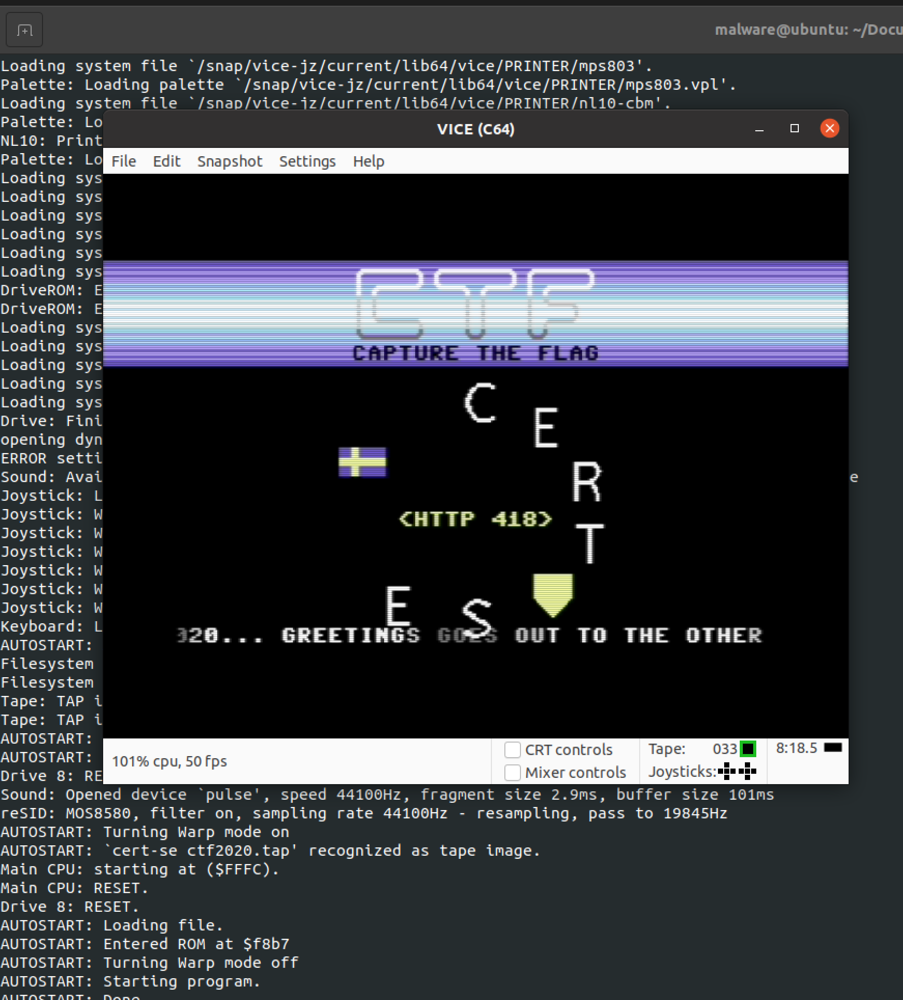

# CERT-SE Challenge 2020

Eftersom jag skrev en lite utförligare text för CERT-SE CTF-2021 tänkte jag uppdatera min lösning för 2020 så jag har dokumenterat samtliga.

Har löst denna förut så kommer bli en kort genomgång denna gång.

Börja med att ladda ner och verifiera filen:

    $ curl -s -O https://cert.se/CERT-SE_challenge2020.zip
    $ sha256sum CERT-SE_challenge2020.zip | grep 7dcd2e3cd62aa3240b61fc15fb4a9e9a5be65a832749e6d73d9e27671cfbd15c
    7dcd2e3cd62aa3240b61fc15fb4a9e9a5be65a832749e6d73d9e27671cfbd15c  CERT-SE_challenge2020.zip
    $ unzip CERT-SE_challenge2020.zip
    Archive:  CERT-SE_challenge2020.zip
      inflating: CERT-SE challenge2020.pcapng

Vad har vi fått för data?

<pre>
$ tshark -r CERT-SE\ challenge2020.pcapng -z io,phs -q
===================================================================
Protocol Hierarchy Statistics
Filter:

eth                                      frames:755 bytes:132091
  llc                                    frames:118 bytes:6136
    stp                                  frames:118 bytes:6136
  ip                                     frames:616 bytes:124813
    udp                                  frames:52 bytes:6336
      dns                                frames:44 bytes:5628
      mdns                               frames:4 bytes:348
      ntp                                frames:4 bytes:360
    tcp                                  frames:564 bytes:118477
      tls                                frames:143 bytes:52021
        tcp.segments                     frames:5 bytes:7548
      http                               frames:8 bytes:3214
        ocsp                             frames:2 bytes:1218
        data-text-lines                  frames:2 bytes:900
      data                               frames:39 bytes:6053
      ftp                                frames:23 bytes:2044
        ftp.current-working-directory    frames:23 bytes:2044
      ftp-data                           frames:6 bytes:20749
        ftp-data.setup-frame             frames:6 bytes:20749
          ftp-data.setup-method          frames:6 bytes:20749
            ftp-data.command             frames:6 bytes:20749
              ftp-data.command-frame     frames:6 bytes:20749
                ftp-data.current-working-directory frames:6 bytes:20749
                  data-text-lines        frames:1 bytes:135
  arp                                    frames:17 bytes:714
  ipv6                                   frames:4 bytes:428
    udp                                  frames:4 bytes:428
      mdns                               frames:4 bytes:428
===================================================================
</pre>

Tittat lite på trafiken och hittade finns IRC i PCAP:en. Ta fram alla **PRIVMSG** som finns i den sessionen.

    $ tshark -q -n -r CERT-SE\ challenge2020.pcapng -z follow,tcp,ascii,7 | grep PRIVMSG
    :Sp3ccyF4n!user@192.168.122.177 PRIVMSG #RetroForum :Yo!
    PRIVMSG #RetroForum :Yo!/Sup?
    :Sp3ccyF4n!user@192.168.122.177 PRIVMSG #RetroForum :Sup?
    PRIVMSG #RetroForum :I was thinking about what you said earlier. I still can't accept that you perfer the Z80?
    :Sp3ccyF4n!user@192.168.122.177 PRIVMSG #RetroForum :What now??? The Spectrum is waaaaay faster than the C64!!!
    PRIVMSG #RetroForum :Sure the CPU, yes. But hardware sprites, a soundship that doesn't sound like a cat beeing strangled, and the possibility for for paralax scrolling?
    :Sp3ccyF4n!user@192.168.122.177 PRIVMSG #RetroForum :You're just talking about superficial "flair". It's like putting makeup on a pig, it's still slow...
    PRIVMSG #RetroForum :Dude you're soooooo wrong!!! Just have a look at the demo I uploaded to the FTP earlier, I'll PM you the password with our usual "encryption".
    PRIVMSG Sp3ccyF4n :The code is: "OC1iaXQtQzBtcHV0M2VyLXcwbmQzciE/".
    :Sp3ccyF4n!user@192.168.122.177 PRIVMSG #RetroForum :Thanks... But I don't think it's relevant. You wont convince me! CPU-power is EVERYTHING. My Z80 is kicking your lazy 6502!!!
    PRIVMSG #RetroForum :Whatever... All I have to say is SID6581, nuff said!
    :Sp3ccyF4n!user@192.168.122.177 PRIVMSG #RetroForum :Like you said... Whatever...

Observera speciellt texten **The code is: "OC1iaXQtQzBtcHV0M2VyLXcwbmQzciE/".**. Den kommer vi behöva senare.

I sammanställningen ovan ser vi att det finns en FTP-överföring. Var är den?

    $ tshark -n -r CERT-SE\ challenge2020.pcapng -T fields -e frame.number -e frame.time -e ip.src -e tcp.port -e ip.dst ftp-data.current-working-directory
    282	Aug 20, 2020 10:38:51.544726450 UTC	192.168.122.156	37593,20	192.168.122.129
    283	Aug 20, 2020 10:38:51.544767005 UTC	192.168.122.156	37593,20	192.168.122.129
    284	Aug 20, 2020 10:38:51.544972878 UTC	192.168.122.156	37593,20	192.168.122.129
    286	Aug 20, 2020 10:38:51.546199427 UTC	192.168.122.156	37593,20	192.168.122.129
    287	Aug 20, 2020 10:38:51.546234484 UTC	192.168.122.156	37593,20	192.168.122.129
    308	Aug 20, 2020 10:38:53.734837396 UTC	192.168.122.129	20,42973	192.168.122.156

Extrahera den filen och se vad det är för filtyp. Kan se att det är **XZ compressed data** så spara ner som **tmp.xz** och packa upp den filen:

    malware@ubuntu:~/Documents$ tshark -q -n -r CERT-SE\ challenge2020.pcapng -z follow,tcp,raw,192.168.122.156:37593,192.168.122.129:20 | grep -v -E "(:|=)" | grep -E "[a-f0-9]" | xxd -r -p | file -
    /dev/stdin: XZ compressed data
    malware@ubuntu:~/Documents$ tshark -q -n -r CERT-SE\ challenge2020.pcapng -z follow,tcp,raw,192.168.122.156:37593,192.168.122.129:20 | grep -v -E "(:|=)" | grep -E "[a-f0-9]" | xxd -r -p > tmp.xz
    malware@ubuntu:~/Documents$ unxz tmp.xz
    malware@ubuntu:~/Documents$

Vad är det vi fått för fil som fanns i .xz?

    $ file tmp
    tmp: POSIX tar archive
    malware@ubuntu:~/Documents$ tar xvf tmp
    demo.zip
    malware@ubuntu:~/Documents$ file demo.zip
    demo.zip: Zip archive data, at least v2.0 to extract

Filen är lösenordsskyddat. Vi hade en kod i IRC-trafiken ovan. Troligen är den base64-enkodad. Testa:

    $ echo -n "OC1iaXQtQzBtcHV0M2VyLXcwbmQzciE/" | base64 --decode
    8-bit-C0mput3er-w0nd3r!?

Öppna zip-filen med lösenordet **8-bit-C0mput3er-w0nd3r!?**:

    $ unzip demo.zip
    Archive:  demo.zip
    [demo.zip] cert-se ctf2020.tap password:
      inflating: cert-se ctf2020.tap

Vad är .tap för filtyp?

    file cert-se\ ctf2020.tap
    cert-se ctf2020.tap: C64 Raw Tape File (.tap), Version:1, Length:201962 cycles

Vi har ett spel eller liknande för C64. Efter lite sökning på Google hittade jag en färdig Snap för Ubuntu av Vice-emulatorn.

    $ sudo snap install vice-jz
    2021-10-17T08:40:30Z INFO Waiting for automatic snapd restart...
    vice-jz 3.3 from Jacob Zimmermann (jz) installed

Kör emulatorn med filen som input.

    $ vice-jz.x64 cert-se\ ctf2020.tap

Se bilden nedan för att få svaret som är HTTP 418.

HTTP status kod [418 I'm a teapot](https://en.wikipedia.org/wiki/Hyper_Text_Coffee_Pot_Control_Protocol) är ett gammalt april-skämt från RFC [2324](https://datatracker.ietf.org/doc/html/rfc2324).

