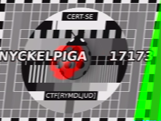
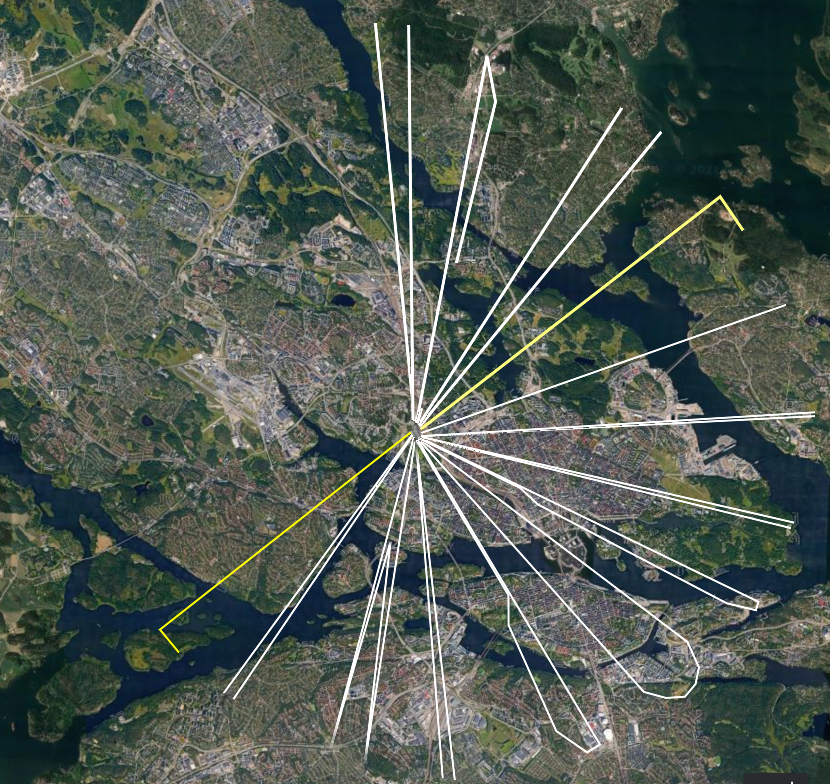

# Anteckningar genomgång CERT-SE CTF2021

Mina anteckningar för att lösa CERT-SE CTF2021. Information om CTF:en finns på [CERT-SE CTF2021](https://cert.se/2021/09/cert-se-ctf2021)

Ladda ner filen [här](https://cert.se/CERT-SE_CTF2021.zip). Har även sparat en lokal kopia i detta GitHub-repo vilket jag hoppas är okej för CERT-SE.

Börja med att verifiera filen. Kör grep på SHA-256 för snabb verifiering.

	$ sha256sum CERT-SE_CTF2021.zip | grep 5b551027a7564119337f2ddebc96e3c6ebbafc3a0572f1488b71955fde5e9706
	5b551027a7564119337f2ddebc96e3c6ebbafc3a0572f1488b71955fde5e9706  CERT-SE_CTF2021.zip

Packa upp filen och läs de svenska instruktionerna.

	$ unzip CERT-SE_CTF2021.zip
	$ cat readme.txt | grep -B20 -E "^-"
	CERT-SE CTF 2021

	Även i år har CERT-SE en utmaning under cybersäkerhetsmånaden. Denna utmaning vänder sig till alla med IT-säkerhetsintresse.

	<scenario>
	CERT-SE har kommit över nätverkstrafik från den fiktiva hackergruppen ”Medelålders Sura Blackhats”.
	Kan du hitta alla flaggorna?
	</scenario>

	I ZIP-filen under finns en nätverksdump (PCAP) som innehåller totalt sex stycken flaggor, dessa har formatet ”CTF[***********]”.

	När du känner att du hittat så många flaggor du kan så får du gärna maila oss dessa samt en beskrivning av hur du löst de olika uppgifterna till cert@cert.se, skriv ”CTF2021” i ärenderaden för mailet. Snabbast, flest flaggor och bäst beskrivning premieras.

	OBS, vi kommer bara acceptera ett svar per person så se till att hitta så många flaggor som möjligt innan du skickar in. Sista dagen att skicka in svar är 31/10-2021.

	-

## Första flaggan

Kontrollera pcap översiktligt.

	$ capinfos CERT-SE_CTF2021.pcap
	File name:           CERT-SE_CTF2021.pcap
	File type:           Wireshark/tcpdump/... - pcap
	File encapsulation:  Ethernet
	File timestamp precision:  microseconds (6)
	Packet size limit:   file hdr: 262144 bytes
	Number of packets:   29k
	File size:           69MB
	Data size:           68MB
	Capture duration:    820.259315 seconds
	First packet time:   2021-09-23 10:16:12.791835
	Last packet time:    2021-09-23 10:29:53.051150
	Data byte rate:      83kBps
	Data bit rate:       669kbps
	Average packet size: 2325.18 bytes
	Average packet rate: 35 packets/s
	SHA256:              a65a7fb044601feef7bcc9f5c1afa84bb847fc3690039dd28df7086c7a1581cd
	RIPEMD160:           0fdd5321dc9fd04864ae32ae6fcb7a9b924b1ead
	SHA1:                e3d4085f26632917a572b399ff1dfbeba27d3aee
	Strict time order:   False
	Number of interfaces in file: 1
	Interface #0 info:
						 Encapsulation = Ethernet (1 - ether)
						 Capture length = 262144
						 Time precision = microseconds (6)
						 Time ticks per second = 1000000
						 Number of stat entries = 0
						 Number of packets = 29519

Passa på att använda flera olika verktyg för att titta på PCAP:en. Alltid roligt att se vad olika verktyg kan för för information. Börjar med att läsa in filen i [Brim](https://www.brimdata.io/).

Filtrering på http visar på surf till bland annat SVT men även till MSB, Polisen, Säkerhetspolisen och Försvarsmaken, FOI, FRA och PTS. Kan nästan tänka att det finns en koppling till NCSC.
### csdb.uk
Trafiken till csdb.uk går troligen till sidan [https://csdb.dk/release/?id=196289](https://csdb.dk/release/?id=196289) som omnämns i [Genomgång av CERT-SE CTF2020](https://www.cert.se/2021/01/genomgang-av-cert-se-ctf2020). Har dock inte gjort en egen hämtning med inspelning för att jämföra trafiken och storlek på paket.

Upptäcker direkt en flagga flagga **CTF[bra_start]**.

Finns inget som sticker från Suricata i Brim eller något annat som verkar speciellt intressant.

Öppna filen i [Wireshark](https://www.wireshark.org/) för en kronologisk översikt av alla paket..

Hittade återigen  flaggan ovan kommer från en GET request från 192.168.122.156.

    GET /CTF[bra_start] HTTP/1.1
    Host: 192.168.122.129
    User-Agent: Mozilla/5.0 (X11; Ubuntu; Linux x86_64; rv:90.0) Gecko/20100101 Firefox/90.0
    Accept: text/html,application/xhtml+xml,application/xml;q=0.9,image/webp,*/*;q=0.8
    Accept-Language: en-US,en;q=0.5
    Accept-Encoding: gzip, deflate
    Connection: keep-alive
    Upgrade-Insecure-Requests: 1

Läs in pcap i [Arkime](https://www.arkime.com) för att få en ytterligare en överblick av trafiken i form av sessioner och även bra överblick av protokoll.

	/opt/arkime/bin/capture -r CERT-SE_CTF2021.pcap

Ser att det finns irc-trafik bland mycket annat. Totalt hittar Arkime 782 sessioner. Kontroll av DNS och TLS gör det troligt att de inte döljer något.

Fortsätt använda olika verktyg och titta på pcap med hjälp av [ndpiReader](https://github.com/ntop/nDPI) (endast delar av output nedan):

	...
	Detected protocols:
	FTP_CONTROL          packets: 70            bytes: 5330          flows: 2
	DNS                  packets: 447           bytes: 51462         flows: 223
	HTTP                 packets: 913           bytes: 134632        flows: 61
	MDNS                 packets: 12            bytes: 1265          flows: 9
	NTP                  packets: 18            bytes: 1620          flows: 9
	DHCP                 packets: 2             bytes: 673           flows: 1
	eDonkey              packets: 92            bytes: 41997         flows: 3
	SSL_No_Cert          packets: 73            bytes: 7690          flows: 4
	IRC                  packets: 1087          bytes: 139089        flows: 5
	ICMP                 packets: 1             bytes: 197           flows: 1
	SSL                  packets: 16146         bytes: 23599220      flows: 113
	ICMPV6               packets: 2             bytes: 124           flows: 2
	Facebook             packets: 20            bytes: 2180          flows: 10
	Twitter              packets: 14            bytes: 1244          flows: 7
	Google               packets: 3415          bytes: 1821618       flows: 135
	UbuntuONE            packets: 201           bytes: 19431         flows: 50
	FTP_DATA             packets: 2945          bytes: 41070884      flows: 3
	Wikipedia            packets: 14            bytes: 1394          flows: 7
	Amazon               packets: 3238          bytes: 1497427       flows: 107
	Cloudflare           packets: 283           bytes: 82501         flows: 12
	GoogleServices       packets: 360           bytes: 150086        flows: 16
	....

Kontroll visar att samtliga FTP-överföringar innehåller intressanta filer. Det är broadcast.7z, memdump.7z och Star!6.kmz. eDonkey är troligen felaktigt taggad. SSL_No_Cert är troligen sessioner som startades innan inspelning av pcap gick igång.

Vad går det på lokala nätet som inte är DNS?

		1	TCP 192.168.122.129:20 <-> 192.168.122.177:58245 [proto: 175/FTP_DATA][cat: Download-FileTransfer-FileSharing/7][661 pkts/43634 bytes <-> 2139 pkts/39948052 bytes]
	7	TCP 192.168.122.129:20 <-> 192.168.122.186:36143 [proto: 175/FTP_DATA][cat: Download-FileTransfer-FileSharing/7][65 pkts/4298 bytes <-> 66 pkts/1071593 bytes]
	86	TCP 192.168.122.156:41284 <-> 192.168.122.129:6667 [proto: 65/IRC][cat: Chat/9][133 pkts/10573 bytes <-> 119 pkts/24483 bytes]
	88	TCP 192.168.122.177:44290 <-> 192.168.122.129:6667 [proto: 65/IRC][cat: Chat/9][128 pkts/11056 bytes <-> 121 pkts/21174 bytes]
	89	TCP 192.168.122.186:37088 <-> 192.168.122.129:6667 [proto: 65/IRC][cat: Chat/9][138 pkts/10798 bytes <-> 128 pkts/21110 bytes]
	90	TCP 192.168.122.251:36346 <-> 192.168.122.129:6667 [proto: 65/IRC][cat: Chat/9][135 pkts/10829 bytes <-> 125 pkts/20603 bytes]
	95	TCP 192.168.122.156:38744 <-> 192.168.122.129:80 [proto: 7/HTTP][cat: Web/5][11 pkts/1645 bytes <-> 11 pkts/26250 bytes][Host: 192.168.122.129]
	162	TCP 192.168.122.177:44140 <-> 192.168.122.129:6667 [proto: 65/IRC][cat: Chat/9][33 pkts/2779 bytes <-> 27 pkts/5684 bytes]
	235	TCP 192.168.122.251:38888 <-> 192.168.122.177:46967 [proto: 175/FTP_DATA][cat: Download-FileTransfer-FileSharing/7][7 pkts/2833 bytes <-> 7 pkts/474 bytes]
	247	TCP 192.168.122.177:54208 <-> 192.168.122.129:21 [proto: 1/FTP_CONTROL][cat: Download-FileTransfer-FileSharing/7][19 pkts/1364 bytes <-> 16 pkts/1302 bytes]
	248	TCP 192.168.122.186:45954 <-> 192.168.122.129:21 [proto: 1/FTP_CONTROL][cat: Download-FileTransfer-FileSharing/7][19 pkts/1362 bytes <-> 16 pkts/1302 bytes]
	249	TCP 192.168.122.156:38726 <-> 192.168.122.129:80 [proto: 7/HTTP][cat: Web/5][8 pkts/1187 bytes <-> 6 pkts/1391 bytes][Host: 192.168.122.129]
	356	UDP 192.168.122.129:68 <-> 192.168.122.1:67 [proto: 18/DHCP][cat: Network/14][1 pkts/331 bytes <-> 1 pkts/342 bytes][Host: se]
	639	ICMP 192.168.122.156:0 -> 192.168.122.1:0 [proto: 81/ICMP][cat: Network/14][1 pkts/197 bytes -> 0 pkts/0 bytes]

Första flaggan: **CTF[bra_start]**

## Andra flaggan

Byt till [Networkminer](https://www.netresec.com/?page=NetworkMiner) för att kolla på filer. Finns en fil som heter broadcast.7z och som delvis är lösenordsskyddad. Lösenordet finns i de filer som inte är skyddade och kan fås fram på följande sätt. Första steget är att försöka packa upp filen och få ut de kataloger och filer som inte är lösenordsskyddade. Siffrorna i underkatalogerna anger ordning på tecken i lösenordet och går att få fram med en rad bash. Sortera output från find på sifforrna i katalogerna och sedan skrive ut katalogbokstaven:

	$ 7z x broadcast.7z
	$ 7z -a x -p$(find . -type f | sort -n -t/ -k5 | cut -f4 -d/ | xargs echo | tr -d ' ') broadcast.7z

Vilket ger följande:

	$ cat Zipper/.secret/-/flag.txt
	ctf[skulle_skippat_linbanan]

Andra flaggan är: **ctf[skulle_skippat_linbanan]**.

## Tredje flaggan

Tittar vi vidare på filen broadcast.wav om det kan finnas stenografiskt gömd information. Hittar inget med stegpy eller stegolsb och börjar därför Googla på kopplingen till ISS och Apollo från IRC-chatten. Ser då att det finns ett protokoll som heter Slow-Scan Television transmissions (SSTV) och via bloggposten [How to convert (decode) a Slow-Scan Television transmissions (SSTV) audio file to images using QSSTV in Ubuntu 18.04](https://ourcodeworld.com/articles/read/956/how-to-convert-decode-a-slow-scan-television-transmissions-sstv-audio-file-to-images-using-qsstv-in-ubuntu-18-04) via denna [sida](https://github.com/Dvd848/CTFs/blob/master/2019_picoCTF/m00nwalk.md) går det att få fram en bild. Kör i temporär VM så **sudo bash** för att det är enklare...:

	root@kali:~$ sudo bash
	root@kali:~# apt-get install qsstv
	root@kali:~# pactl load-module module-null-sink sink_name=virtual-cable
	22
	root@kali:~# pavucontrol # A GUI will pop-up, go to the "Output Devices" tab to verify that you have the "Null Output" device
	root@kali:~# qsstv # The program GUI will pop-up, go to "Options" -> "Configuration" -> "Sound" and select the "PulseAudio" Audio Interface
	root@kali:~# # Back in the pavucontrol GUI, select the "Recording" tab and specify that QSSTV should capture audio from the Null Output
    root@kali:~# At this point we can click the "Play" button in QSSTV to start the receiver, and then play the audio file:
	root@kali:/media/sf_CTFs/pico/m00nwalk# paplay -d virtual-cable message.wav

Kopiera ut bilden och släng bort den virtuella maskinen.

Med verktygen ovan får vi fram bilden nedan:

Tredje flaggan är: **CTF[RYMDLJUD]**

## Fjärde flaggan

Tittar vidare i Arkime och ser en del roliga saker. En är att Polismyndigheten har börjat köra en egen webbserver :)...

Ser en hämtning till i klartext och det är sidan med ett manifest för "Medelålders Sura Blackhats" (=MSB ... :) ) som utöver text av Kafka även innehåller en bild med namnet giveup.png (var försiktig med tanke på namnet...). Manifestet i sig verkar inte dölja något och diff mot text hittat på nätet ger inga relevanta skillnader. Men det finns en QR-kod. Kolla den via cli:

	$ sudo apt install zbar-tools
	$ zbarimg giveup.jpg | grep QR | cut -f2 -d: | base64 --decode
	scanned 1 barcode symbols from 1 images in 0.04 seconds
	
	https://youtu.be/dQw4w9WgXcQ
	
Då filnamnet indikerar ett gammalt hederligt skämt på internet så undvik att behöva se den videon och verifiera titel på sidan via [curl](https://curl.se/) istället.

	curl -s -L https://youtu.be/dQw4w9WgXcQ | grep -i -o '<title>[^<]*</title>'
	<title>Rick Astley - Never Gonna Give You Up (Official Music Video) - YouTube</title>

Som sagt, klicka inte på länkar...

HTML-kommentaren indikerar att detta är en del av CTF:en. Då jag inte hittar något avvikande i texten rörande färger, avvikelse från ursprungliga texten av Kafka så är det troligen bilden som döljer något mer än QR-koden. Kollat många olika sorters verktyg för stenografi utan resultat men hittade till slut stegseek:

	┌──(kali㉿kali)-[~]
	└─$ sudo dpkg --install Downloads/stegseek_0.6-1.deb
	Selecting previously unselected package stegseek.
	(Reading database ... 300142 files and directories currently installed.)
	Preparing to unpack Downloads/stegseek_0.6-1.deb ...
	Unpacking stegseek (0.6-1) ...
	Setting up stegseek (0.6-1) ...

	┌──(kali㉿kali)-[~]
	└─$ stegseek Downloads/giveup.jpg
	StegSeek 0.6 - https://github.com/RickdeJager/StegSeek

	[i] Found passphrase: ""
	[i] Original filename: "flag.txt".
	[i] Extracting to "giveup.jpg.out".

	┌──(kali㉿kali)-[~]
	└─$ cat giveup.jpg.out
	CTF[chameleon]

Koden kommer ifrån [stegseek](https://github.com/RickdeJager/stegseek)-repot på GitHub och jag laddade ner version [0.6](https://github.com/RickdeJager/stegseek/releases/download/v0.6/stegseek_0.6-1.deb).

Fjärde flaggan är: **CTF[chameleon]**

## Femte flaggan

Titta nu på memdump.dmp som filen heter efter att vi packar upp memdump.7z som det även pratas om i IRC. Identifiera aktuell kernel:

	$ strings memdump4.dmp | egrep '^Linux.*[0-9.]{3,}.*SMP'
	Linux dumpen 4.9.0-6-amd64 #1 SMP Debian 4.9.82-1+deb9u3 (2018-03-02) x86_64
	Linux version 4.9.0-6-amd64 (debian-kernel@lists.debian.org) (gcc version 6.3.0 20170516 (Debian 6.3.0-18+deb9u1) ) #1 SMP Debian 4.9.82-1+deb9u3 (2018-03-02)
	Linux version 4.9.0-6-amd64 (debian-kernel@lists.debian.org) (gcc version 6.3.0 20170516 (Debian 6.3.0-18+deb9u1) ) #1 SMP Debian 4.9.82-1+deb9u3 (2018-03-02)

Vi har tur och det finns en profil som fungerar från [Volatility](https://github.com/volatilityfoundation/volatility):

https://github.com/volatilityfoundation/profiles/blob/master/Linux/Debian/x64/Debian94.zip

	curl -s -O https://github.com/volatilityfoundation/profiles/raw/master/Linux/Debian/x64/Debian94.zip

Valde att göra Volatility 2 då jag hade problem med 3 och två fungerade bra.

Kör vi pslist ser  vi följande intressanta namn (börjar med att tänka enkelt):

	0xffff9c984d628080 SuperSecretLogo      414             403             1000            1000   0x000000000a4cc000 2021-08-03 10:21:32 UTC+0000

Den hittas även med funktionen linux_malfind:

	$ python2.7 /usr/local/bin/vol.py --plugins=./ -f Documents/CTF2021/Findings/extract/memdump4/memdump4.dmp --profile=LinuxDebian94x64 linux_malfind  | grep -v "Failed to import"
	Volatility Foundation Volatility Framework 2.6.1
	/usr/local/lib/python2.7/dist-packages/volatility/plugins/community/YingLi/ssh_agent_key.py:12: CryptographyDeprecationWarning: Python 2 is no longer supported by the Python core team. Support for it is now deprecated in cryptography, and will be removed in the next release.
	  from cryptography.hazmat.backends.openssl import backend
	Process: SuperSecretLogo Pid: 414 Address: 0x404000 File: /home/user/SuperSecretLogonTool
	Protection: VM_READ|VM_WRITE|VM_EXEC
	Flags: VM_READ|VM_WRITE|VM_EXEC|VM_MAYREAD|VM_MAYWRITE|VM_MAYEXEC|VM_DENYWRITE|VM_ACCOUNT|VM_NONLINEAR|VM_CAN_NONLINEAR

	0x00000000404000  20 3e 40 00 00 00 00 00 70 e1 1b 64 24 7f 00 00   .>@.....p..d$...
	0x00000000404010  e0 f2 fa 63 24 7f 00 00 30 10 40 00 00 00 00 00   ...c$...0.@.....
	0x00000000404020  a0 e7 c8 63 24 7f 00 00 90 2f c6 63 24 7f 00 00   ...c$..../.c$...
	0x00000000404030  90 91 c4 63 24 7f 00 00 70 10 40 00 00 00 00 00   ...c$...p.@.....

	0x404000 203e             AND [RSI], BH
	0x404002 400000           ADD [RAX], AL
	0x404005 0000             ADD [RAX], AL
	0x404007 0070e1           ADD [RAX-0x1f], DH
	0x40400a 1b64247f         SBB ESP, [RSP+0x7f]
	0x40400e 0000             ADD [RAX], AL
	0x404010 e0f2             LOOPNZ 0x404004
	0x404012 fa               CLI
	0x404013 63247f           MOVSXD ESP, DWORD [RDI+RDI*2]
	0x404016 0000             ADD [RAX], AL
	0x404018 3010             XOR [RAX], DL
	0x40401a 400000           ADD [RAX], AL
	0x40401d 0000             ADD [RAX], AL
	0x40401f 00a0e7c86324     ADD [RAX+0x2463c8e7], AH
	0x404025 7f00             JG 0x404027
	0x404027 00902fc66324     ADD [RAX+0x2463c62f], DL
	0x40402d 7f00             JG 0x40402f
	0x40402f 009091c46324     ADD [RAX+0x2463c491], DL
	0x404035 7f00             JG 0x404037
	0x404037 007010           ADD [RAX+0x10], DH
	0x40403a 400000           ADD [RAX], AL
	0x40403d 0000             ADD [RAX], AL
	0x40403f 00               DB 0x0
	...

Se om vi kan hitta filen genom att dumpa filsystemet (sudo för att vol.py vill sätta rätt ägare på filerna):

	sudo python2.7 /usr/local/bin/vol.py --plugins=./ -f Documents/CTF2021/Findings/extract/memdump4/memdump4.dmp --profile=LinuxDebian94x64 linux_recover_filesystem -D out | grep -v "Failed to"

Filen finns där under användarens hemmakatalog. Strings på filen gör att vi hittar lösenordet "h3mlig!" i filen. Men det ger inte svaret när man kör programmet (VM så kör filen - vad kan möjligen gå fel...). Kontrollera filen med radare2. Först **aaa** för att analysera filen och sedan **afl** för att lista funktioner.

	$ r2 SuperSecretLogonTool
	 -- Now with more better English!
	[0x004010f0]> aaa
	[x] Analyze all flags starting with sym. and entry0 (aa)
	[x] Analyze function calls (aac)
	[x] Analyze len bytes of instructions for references (aar)
	[x] Check for objc references
	[x] Check for vtables
	[x] Type matching analysis for all functions (aaft)
	[x] Propagate noreturn information
	[x] Use -AA or aaaa to perform additional experimental analysis.
	[0x004010f0]> afl
	0x004010f0    1 46           entry0
	0x00401130    4 33   -> 31   sym.deregister_tm_clones
	0x00401160    4 49           sym.register_tm_clones
	0x004011a0    3 33   -> 32   entry.fini0
	0x004011d0    1 6            entry.init0
	0x004015e0    1 5            sym.__libc_csu_fini
	0x004015e8    1 13           sym._fini
	0x0040143e    1 167          sym.print_cert_se
	0x004010b0    1 11           sym.imp.puts
	0x00401570    4 101          sym.__libc_csu_init
	0x00401120    1 5            sym._dl_relocate_static_pie
	0x004014e5    4 136          main
	0x004011d6    9 616          sym.print_flag
	0x00401000    3 27           sym._init
	0x00401090    1 11           sym.imp.putchar
	0x004010a0    1 11           sym.imp.strncpy
	0x004010c0    1 11           sym.imp.printf
	0x004010d0    1 11           sym.imp.strcmp
	0x004010e0    1 11           sym.imp.gets
	[0x004010f0]>

Av de funktioner som listas verkar **sym.print_flag** mycket intressant. Kan vi komma till den via vanlig execvering av programmet? Vad jag kunnat se är så inte fallet.

Istället kan vi patcha programmet så att vi anropar denna funktion istället för någon annan. Jag valde att byta ut anropet till utskrift av CERT-loggan för att även slippa skriva in lösenordet. Lös detta genom att göra följande. Loggan var snygg kan jag tillägga.

Starta om radare2 med rw för att kunna skriva den patchade filen.

	$ cp SuperSecretLogonTool patchme
	$ r2 -Aw patchme
	> aaa
	> s main
	> pdf
	> s 0x004014f6
	> V
	P
	A
	call sym.print_flag
	Y
	q
	q
	$ ./patchme
	Bra gjort! Här kommer flaggan: CTF[Stackars_Myrstack]
	Ange lösenord:

CTRL-C för att avsluta. Stegen ovan är att köra **aaa** för att anlysera filen. Sök sedan fram main, **s main**. Titta på main med **pdf** och se att vill ändra på position **0x004014f6** så sök fram oss dit med hjälp av **s 0x004014f6**. Gå sedan i in i Visuellt läge med **V**. Ändra vy med **p** och gör en Append på raden med *A*. Skriv in nya anropet till rätt funktion **call sym.print_flag** och tryck enter. Sedan **Y** för att spara och **q** två gånger för att sluta. Kör sedan den patchade filen och få flaggan.

Femte flaggan är: **CTF[Stackars_Myrstack]**

Tittade mer i filsystemet och kontrollerade om det fanns något mer att hitta. Kan det finnas något lösenord som är en flagga? Ska vi försöka knäcka lösenord av typen "CTF[<sträng>]". Börja med att se om lösenorden är enkla:

	$ john passwd.txt
	Created directory: /home/malware/.john
	Loaded 2 password hashes with 2 different salts (crypt, generic crypt(3) [?/64])
	Press 'q' or Ctrl-C to abort, almost any other key for status
	rootroot         (root)
	rootroot         (user)
	2g 0:00:00:00 100% 1/3 3.571g/s 341.0p/s 342.8c/s 342.8C/s user..rootroot
	Use the "--show" option to display all of the cracked passwords reliably
	Session completed

Samma lösenord på båda kontona och inget spår att titta vidare på.

Femte flaggan: **CTF[Stackars_Myrstack]**

## Sjätte flaggan

Fortsätt kolla på IRC. Det finns en "DCC SEND". I session med community-id 1:yjgr5i06O40pG4Am28YaOa+XrWs= kan vi extrahera en zip-fil som innehåller en KML-fil. Kontroll i [Google earth](https://earth.google.com/web/) visar massa streck kring [MSB](https://www.msb.se) huvudkontor i Solna. Då jag trodde att denna uppgift var svårare än den egentligen var så tog denna fråga längst tid.

Från bilden nedan kan vi få ut ett antal bokstäver:

Tittar vi närmare på strecken kan vi få ut följande bokstäver (uppifrån och följa medurs):

    [XGU]IVHRORVMH

Det är inte rot13 och [CyberChef](https://gchq.github.io/CyberChef/) hittar inget direkt med sin funktion magic. Låt oss istället titta vidare på strängen i [ciphey]() och ange att vi vet att den av den innehåller strängen CTF. Börja med att installera (tar ej med output):

    $ python3 -m venv ciphey
    $ source ciphey/bin/activate
    $ python3 -m pip install -U pip
    $ python3 -m pip install -U ciphey

Sedan kan vi köra ciphey:

    $ ciphey -t "[XGU]IVHRORVMH" -C regex -p regex.regex=CTF
    ╭──────────────────────────────────────╮
    │ Formats used:                        │
    │    atbashPlaintext: "[CTF]RESILIENS" │
    ╰──────────────────────────────────────╯

Vi har äntligen fått den sjätte och enligt uppgift sista flaggan.

Sjätte flaggan är: **[CTF]RESILIENS**

## Flaggor

Första flaggan: **CTF[bra_start]**
Andra flaggan är: **ctf[skulle_skippat_linbanan]**.
Tredje flaggan är: **CTF[RYMDLJUD]**
Fjärde flaggan är: **CTF[chameleon]**
Femte flaggan är: **CTF[Stackars_Myrstack]**
Sjätte flaggan är: **[CTF]RESILIENS**

## Verktyg

Utöver verktygen jag listat ovan har jag testat flera andra utan resultat. Har kört i virtuella maskiner jag installerat med [packer](https://www.packer.io/) från mitt repo med samma namn, [packer](https://github.com/reuteras/packer). Började med en installation av [REMnux](https://remnux.org/) där jag även installerade Akrime med hjälp av mitt repo [remnux-tools](https://github.com/reuteras/remnux-tools) och skriptet **./bin/setup-arkime.sh**

## Sammanfattning

Kul och mycket välgjord CTF av CERT-SE! Varierande uppgifter och roligt med flaggor som fås fram genom en stor variation av tekniker. Ser fram emot CTF2022!
